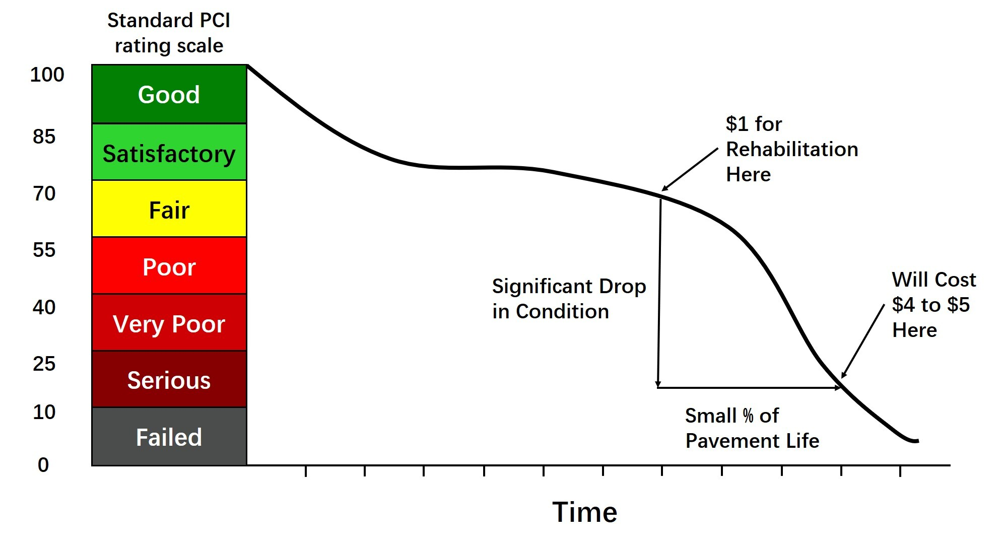
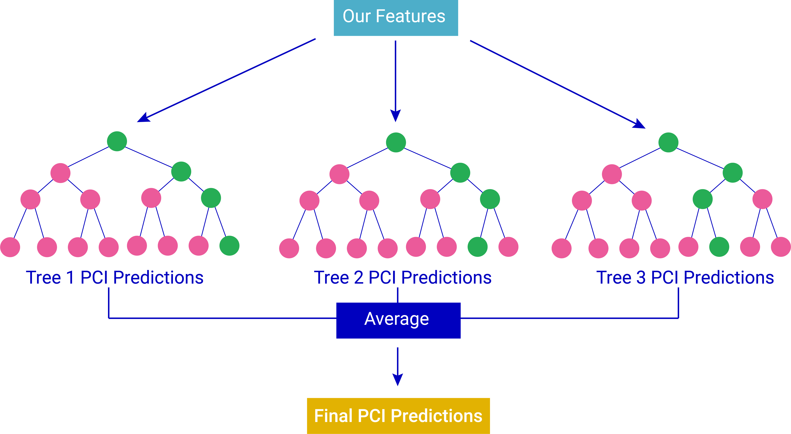

```{r setup, include=FALSE,message = FALSE,cache=TRUE}
knitr::opts_chunk$set(echo = TRUE)
```

```{r libraries, message=FALSE, warning=FALSE, results='hide'}
library(dplyr)
library(tidyverse)
library(sf)
library(lubridate)
library(tigris)
library(tidycensus)
library(ggplot2)
library(viridis)
library(riem)
library(gridExtra)
library(knitr)
library(kableExtra)
library(caret)
library(purrr)
library(FNN)
library(stargazer)
library(spatstat)
library(raster)
library(spdep)
library(grid)
library(mapview)
library(stringr)
library(ggcorrplot)
library(scales)
library(colorspace)
library(rgdal)          
library(RColorBrewer) 
library(rasterVis)    
library(sp)
library(ggpubr)
library(leaflet)
library(transformr)
library(jtools)
library(mapview)
library(randomForest)
library(e1071)  # SVM
library(xgboost)
library(readr)
library(car)

palette_5 <- c("#0c1f3f", "#08519c", "#3bf0c0", "#e6a52f", "#e76420")
#palette_5blues <-c("#eff3ff","#bdd7e7","#6baed6","#3182bd","#08519c")
palette_4 <-c("#08519c","#3bf0c0","#e6a52f","#e76420")
palette_2 <-c("#e6a52f","#3FB0C0")
palette_3 <-c("#e6a52f","#3FB0C0", "#e76420")

palette_5_mako <- c("#0B0405", "#3E356B", "#357BA2", "#49C1AD", "#DEF5E5")
palette_2_mako <- c("#3E356B", "#49C1AD")

#show_col(viridis_pal(option="G")(5))

source("https://raw.githubusercontent.com/urbanSpatial/Public-Policy-Analytics-Landing/master/functions.r")

mapTheme <- function(base_size = 12) {
  theme(
    text = element_text( color = "black"),
    plot.title = element_text(size = 16,colour = "black"),
    plot.subtitle=element_text(face="italic"),
    plot.caption=element_text(hjust=0),
    axis.ticks = element_blank(),
    panel.background = element_blank(),axis.title = element_blank(),
    axis.text = element_blank(),
    axis.title.x = element_blank(),
    axis.title.y = element_blank(),
    panel.grid.minor = element_blank(),
    panel.border = element_rect(colour = "black", fill=NA, size=2),
    strip.text.x = element_text(size = 14))
}

plotTheme <- function(base_size = 12) {
  theme(
    text = element_text( color = "black"),
    plot.title = element_text(size = 16,colour = "black"),
    plot.subtitle = element_text(face="italic"),
    plot.caption = element_text(hjust=0),
    axis.ticks = element_blank(),
    panel.background = element_blank(),
    panel.grid.major = element_line("grey80", size = 0.1),
    panel.grid.minor = element_blank(),
    panel.border = element_rect(colour = "black", fill=NA, size=2),
    strip.background = element_rect(fill = "grey80", color = "white"),
    strip.text = element_text(size=12),
    axis.title = element_text(size=12),
    axis.text = element_text(size=10),
    plot.background = element_blank(),
    legend.background = element_blank(),
    legend.title = element_text(colour = "black", face = "italic"),
    legend.text = element_text(colour = "black", face = "italic"),
    strip.text.x = element_text(size = 14)
  )
}

```


```{r message=FALSE, warning=FALSE}
# RData from EDA part
# load("Data/EDA2.RData")

# the only thing need to load 04/26
load("Data/All_feature_models.RData")

```


# 1.Introduction

This project is part of the Spring 2022 [Master of Urban Spatial Analytics/Smart Cities Practicum course (MUSA 801)](https://pennmusa.github.io/MUSA_801.io/)at the University of Pennsylvania taught by Michael Fichman and Matt Harris.

Thank you to Alex Hoffman, AICP at the El Paso Capital Improvements Department for connecting us with all of the data and background context, and for his support and enthusiasm for bringing data analytics to the city. 

We’d also like to thank MUSA Faculty: Michael Fichman, Matt Harris, and Mjumbe Poe for their superior guidance and support throughout this semester.


# 2. Project Context & Use Case

The City of El Paso, Texas has been experiencing tremendous growth over the past decade. With growing population comes more pressure - literally - on roads.

There is hope that passage of the Bipartisan Infrastructure Bill in congress will allow for more funding for streets and maintenance projects to help the city's road network become safer and more resilient - but the eventual funding from "Build Back Better" still leaves decision-making process of which local roads to update up to the city.

The City of El Paso's Capital Improvement Department (Planning Division) wishes to improve their system for deciding where to allocate capital improvement funds for roadway projects. Presently, this is done by integrating spatial data sets reflecting current conditions to determine where there is need and opportunity.

There currently is not an established prioritization system when it comes to which roads to improve - or even add to the queue for improvement. PCI scores inform the decision making, but lots of the decisions are ad hoc. For example, constituents raise concerns about certain roads, the department looks at the Pavement Condition Index (PCI) score, and if it is below a certain threshold, then they add it to the list of projects for improvement. This is a very reactive process. They would like it to be more proactive.

But PCI also does not tell the whole story, and the client has expressed interest in exploring other factors that may drive a new prioritization system.

This project is two-pronged:

-   First, we have the **predictive model**. We will predict PCI based on 2018 historical data and lots of feature engineering - which we will discuss shortly. This part of the project is mostly for the exercise of modeling in the academic setting of MUSA801, but the client could always choose to integrate our model outputs of PCI into tools later on.

-   The second part of our project is the **prioritization system**, which will take the form of a web application. We incorporate PCI (our modeled score that can be replaced with the PCI used by the city once their 2021 study is complete) as just one piece of a resource application and prioritization system. We will be exploring factors to drive the new system that include both built and social environmental variables, thus bringing a lens of equity into the project.

# 3. Background Research

## 3.1. Pavement Condition Index (PCI)

A Pavement Condition Index (PCI) measures the quality of a specific road segment. The Capital Improvements Department in El Paso hired a private contractor in 2018 to conduct a digital image scan of the city's roads to evaluate them based on a wide range of conditions. While their exact metrics are proprietary, generally, PCIs are based off of factors such as presence of potholes, bumps, or cracks. The index ranges from a qualitative scale of _Failing_ to _Good_ or quantitatively _0_ to _100_. This chart from an Army Corps of Engineers' study shows a significant drop in condition of a road after a certain amount of time. We consider the cost savings calculations from this study when building in the second part of our project, the decision-making tool. This would be a strong advocacy tool for improving a road as well as a strong planning tool by considering the road's lifetime. For the first portion of the project, this made us curious about the construction of roads and if there are any earlier stage indicators that could show signs of weakening conditions.

```{r echo=TRUE, fig.cap = "Graphic Informed by Colorado State University - PAVER software"}

```

## 3.2. Road Anatomy

To hypothesize what conditions could weaken a road overtime, we wanted to understand the different parts of a road. We identified three main road anatomy-related features to pay attention to: the earth foundation, the roadbed base, and the road surface.

```{r echo=TRUE, fig.cap = "Image source: Merriam-Webster"}


```

The surface as an important feature is more obvious as potholes, bumps, and cracks are noticeable to the everyday road user. However, there are roads that have no base layer, weak materials, or are built in areas prone to flooding that can weaken the road's structure as it ages. These are all important aspects of a road's anatomy that we explored in during our exploratory data analysis and their relationship to PCI.

# 4. Exploratory Data Analysis

For this section, we loaded and processed data provided by the City of El Paso and other open data sources. These datasets formed the basis for our data wrangling and feature engineering. The feature summary tables below include the sources for each dataset.

## 4.1. Feature Summary

We considered how various factors can contribute to the overall “wear and tear” of a road, and grouped our features into three overarching categories: **Road Conditions**, **Environment**, and **Road Network**. 
* Road Conditions
* Road Network 
* Environment

The far right column indicates if the feature was ultimately used in our final model.The next several subsections go into detail on how these features were engineered and what decisions went into determining their inclusion in the modeling.

**Features: Road Conditions**

Road Conditions features indicate anything that has to do with the physical properties of a road.


| Feature                          | Type          | Source                                                      | Used in Final Model? |
|:---------------------------------|:--------------|:------------------------------------------------------------|:---------------------|
| Roadbed Base Material            | Categorical   | TxDOT                                                       | Yes
| Roadbed Surface Material         | Categorical   | TxDOT                                                       | Yes
| Roadbed Width                    | Numeric       | TxDOT                                                       | No
| Potholes (by Road Length)        | Numeric       | *Engineered* from City of El Paso Streets & Maintenance Data| Yes
| Road Age                         | Numeric       | City of El Paso                                             | Yes

**Features: Environment**

The environment group includes features that may indirectly affect road conditions like if there is water nearby, what is the majority land use category, or how many city amenities are near road segments like entertainment, restaurants or shops that would indicate a lot of travel happening on those roads.


| Feature                          | Type          | Source                                                      | Used in Final Model? |
|:---------------------------------|:--------------|:------------------------------------------------------------|:---------------------|
| Land Use                         | Categorical   | City of El Paso                                             | Yes
| Land Cover                       | Categorical   | USGS National Land Cover Database                           | No
| High Flood Risk Area or Not      | Binary        | *Engineered* from FEMA 2020 Preliminary Flood Zones         | Yes
| Distance to Hydrology            | Numeric       | *Engineered* from TIGER/Line Texas Geodatabase - Hydrology  | Yes
| Distance to Food/Drink Amenity   | Numeric       | *Engineered* from OpenStreetMap (3rd nearest neighbor)      | Yes
| Distance to Car Facility Amenity | Numeric       | *Engineered* from OpenStreetMap (3rd nearest neighbor)      | Yes
| Distance to Entertainment Amenity| Numeric       | *Engineered* from OpenStreetMap (3rd nearest neighbor)      | Yes
| Below Interstate 10 or Not       | Numeric       | *Engineered* from TIGER/Line Texas Geodatabase - Roads      | Yes


**Features: Road Network**

The road network feature group consists of data that describes how the different road segments interact with one another.


| Feature                          | Type          | Source                                                      | Used in Final Model? |
|:---------------------------------|:--------------|:------------------------------------------------------------|:---------------------|
| Road Class                       | Categorical   | City of El Paso                                             | Yes
| Distance to Major Intersection   | Numeric       | *Engineered* from City of El Paso Centerlines Data          | Yes
| Distance to Major Arterial       | Numeric       | *Engineered* from TxDOT                                     | Yes
| Crashes (By Road Length)         | Numeric       | City of El Paso                                             | Yes
| Vehicle Miles Traveled (VMT)     | Numeric       | Replica, via City of El Paso                                | Yes
| Traffic Jams (By Road length)    | Numeric       | *Engineered* from Waze, via City of El Paso                 | No


## 4.2. Census Data

Because the client mentioned they wanted to include an aspect of equity into the decision making process, we analyzed data from the US Census. Data from the 5-year American Community Survey (ACS) and TIGER/Lines national datasets help us better understand the population that rely on the roads. 

The demographic and socioeconomic breakdown of El Paso’s population allows the city to be mindful of equity while allocating funds for road improvement projects. Although this is an important factor to include in the decision making process, we ultimately determined this data would be most useful in the web application and not in the predictive model as it is unlikely the private contractor considered equity when assigning the PCI scores in 2018. 


### 4.2.1. El Paso Demographics and Socioeconomics

We looked at race, ethnicity, age, income, and transportation to work data through the ACS 2019 5-year dataset to see the demographic breakdown of the city.

```{r plot the poplation pyramid, message=FALSE, warning=FALSE}
ggplot(pop_pyramid, aes(x = variable, fill = Sex,
                 y = ifelse(test = Sex == "Male",
                            yes = -value, no = value))) + 
  geom_bar(stat = "identity") +
  # geom_line(aes(x = "15 to 19 years"), color = "red", size=1) +
  scale_y_continuous(labels = abs, limits = max(pop_pyramid$value) * c(-1,1)) +
  scale_fill_manual(values=palette_2_mako)+
  labs(title = "Population Pyramid", x = "Age Group", y = "Population by Gender") +
  coord_flip() + plotTheme()
```

```{r census_socioecon_transport_map, message=FALSE, warning=FALSE}
#pct transport to work map
ggplot()+
  geom_sf(data=EP_econ, aes(fill=pct_transport_to_work), color="grey")+
  scale_fill_viridis(option='G', direction=-1)+
  labs(title="Percent Population with Transportation to Work in 2019",
       fill="% Transport \nto Work",
       subtitle="Census Tracts in El Paso, TX", caption="Source: US Census, ACS 2019") + mapTheme()
```

The population pyramid shows that El Paso’s population is young, and the working age population accounts for a large proportion of the total. We can infer that this means many people commute to work and, thus, rely on safe roads on a daily basis. To confirm, we generated a map of the percent of the population that has a means of transportation to work from the ACS. The map shows very little of the population works from home so safe roads are crucial to the city’s population. 

```{r census_demo_maps, eval=FALSE, message=FALSE, warning=FALSE, include=FALSE}
# race map
race_long <- EP_race%>%
  dplyr::select(GEOID,NAME, pctWhite, pctBlack, -pctNAT, pctAsian, pctPI, pctOther, pctTwo_plus)%>%
  gather(variable, value, -geometry, -GEOID, -NAME)

race_vars <- unique(race_long$variable)
mapList <- list()

for(i in race_vars){
  mapList[[i]] <-
    ggplot() +
      geom_sf(data = filter(race_long, variable == i), aes(fill=value), colour=NA) +
      scale_fill_viridis(option='G',name="") +
      labs(title=i) +
      mapTheme()}

do.call(grid.arrange,c(mapList, ncol = 3, top = "Race by Census Tract"))

```

```{r census race ethnicity maps, message=FALSE, warning=FALSE}
#pct white map
pctWhite_map <- ggplot()+
  geom_sf(data=EP_race, aes(fill=pctWhite), color="grey")+
  scale_fill_viridis(option='G', direction=-1)+
  labs(title="Percent White in 2019",
       fill="% White",
       subtitle="Census Tracts in El Paso, TX",
       caption = "Source: US Census, ACS 2019\n\nNote: Gray tracts indicate no data") + mapTheme()

#ethnicity map - Hispanic or Latino
ethnicity_hisp_lat_map <- ggplot()+
  geom_sf(data=EP_ethnicity, aes(fill=pctHL), color="grey")+
  scale_fill_viridis(option='G', direction=-1)+
  labs(title="Percent Hispanic or Latino in 2019",
       fill="% Hispanic \nor Latino",
       subtitle="Census Tracts in El Paso, TX",
       caption = "Source: US Census, ACS 2019\n\nNote: Gray tracts indicate no data") + mapTheme()

grid.arrange(pctWhite_map, ethnicity_hisp_lat_map, ncol=2)
```
```{r Median household income map, message=FALSE, warning=FALSE}
#Median household income
 ggplot()+
  geom_sf(data=EP_econ, aes(fill=med_hh_income), color="grey")+
  scale_fill_viridis(option='G', direction=-1)+
  labs(title="Median Household Income in 2019",
       fill="Dollars ($)",
       subtitle="Census Tracts in El Paso, TX", caption="Source: US Census, ACS 2019\n\nNote: Gray tracts indicate no data") + mapTheme()
```

These maps show that the majority of the city’s population identifies as White or Hispanic or Latino. As pointed out by our client, El Paso has a history of disinvestment in the minority communities that live south of Interstate 10. This trend can be further observed in the median income map where tracts with the lowest median incomes are below this highway. This can mean poor data collection in these census tracts which is important to be aware of when creating our model and also reinforces the motivation to include equity in the decision making tool. 

### 4.2.2. El Paso Hydrology

We also import the hydrology features from the US Census TIGER/Line Geodatabase. The map below shows that El Paso does not have an extensive hydrology network, and water is concentrated mostly to the southwestern border of the city.

```{r visualize hydrology, message=FALSE, warning=FALSE}
ggplot()+
  geom_sf(data=El_Paso_city, aes(), color="grey")+
  geom_sf(data = EPhydrology, color = '#357BA2', alpha = 0.9, show.legend = T)+ 
  labs(title="Hydrology Across the City",
       subtitle="El Paso, TX", caption="Source: US Census - TIGER/Line Shapefiles") + mapTheme()

```


## 4.3. Data Wrangling and Feature Engineering

### 4.3.1. Outcome Variable: PCI

#### Road Centerlines and PCI Exploration

In this portion of our exploratory data analysis, we dug deeper into existing road centerlines data (`EPCenterline`) provided by the City of El Paso.

Data cleaning and wrangling on the `EPCenterline` data layer included:
- Removing some unneeded columns to keep the data frame tidy and readable
- Clipping the data layer to the city level to focus more on our study area
- Removing some duplicated **LOCAL** classes
- Joining centerlines data with PCI 2018 values and the latest resurfacing year by joining `EPCenterline` to `centerline_with_age` 
- Combining similar road classes, per client request

After speaking to our client, we only keep four pavement categories that fall under the city's jurisdiction for maintenance - **LOCAL**, **MINOR**, **MAJOR**, and **COLLECTOR**. We can see that most of the segments belong to the **LOCAL** category.

```{r EP centerlines ggplots, message=FALSE, warning=FALSE}
ggplot() +
  geom_sf(data = EPCenterline, aes(color = CLASS), alpha=0.8, size=0.6, show.legend = "line") +
  scale_color_manual(values=palette_4)+
  labs(title = "Road Centerlines by Class",
       fill="Class",
       subtitle = "El Paso, TX") + mapTheme()

```

PCI values are assigned at the road segment level, so we selected road segments as our spatial unit of analysis.

Here we focus on fundamental visualizations on the features of `EPCenterline_with_PCI`. As is shown in the plots below, **LOCAL** and **COLLECTOR** segments have higher average PCI values, while segments in **MAJOR** class tend to have more problems in pavement condition. When it comes to different planning areas, segments in Northwest El Paso and the Art Craft region have better pavement conditions, while the central region performs poorly.

```{r explore centerline data with PCI values from 2018 with visuals, message=FALSE, warning=FALSE}
ggplot(EPCenterline_with_PCI, aes(y=CLASS)) +
  geom_bar(width=0.5, color="black", fill = "#357BA2") +
  labs(title = "Road Centerlines by Class",
       y="Class",
       x="Count",
       subtitle = "El Paso, TX") + plotTheme()
```

We plot the histogram of the PCI distribution for the cleaned dataset shown below, and detect some negative PCI values from the plot. According to our client, these negative PCI scores are assigned to segments that are highways, interstates, private roads, etc., which are out of the city's responsibility for maintaining. After removing segments with negative PCIs, we get a new PCI distribution, which shows three peaks in numbers at the value ranges of **98-100**, **80-85**, and **58-63**.

```{r centerline with pci, message=FALSE, warning=FALSE}

# unique(center_line$PCI_2018)
ggplot(EPCenterline_with_PCI, aes(y=PCI_2018), color="grey") +
  geom_bar(width=0.6, color="transparent", fill = "#357BA2") +
  labs(title = "PCI 2018 Score Distribution",
       x="Count",
       y="PCI",
       subtitle = "El Paso, TX") + plotTheme()

```

The interactive map below shows the road segments colored by PCI score to see the spatial distribution of scores across the city. Higher scores - denoted by the darker purples - tend to be located towards the outer edges of the city, especially to the eastern portions.

```{r centerlines with pci map, message=FALSE, warning=FALSE}
library(mapview)

mapview(EPCenterline_with_PCI, zcol="PCI_2018", color = c("#DEF5E5", "#49C1AD", "#357BA2", "#3E356B", "#0B0405"), popup=FALSE, layer.name = "Road Centerlines by 2018 PCI Scores")

```


### 4.3.2 Waze Jams

Vehicle congestion adds to the pressure on pavement, so we explored traffic jam counts from the Waze data provided by the City.

```{r eval=FALSE, include=FALSE}
# To get the X and Y coordinates for the traffic jam data from Waze, we applied string extraction on the raw `waze_data` dataset and build up a spatial data frame.
x_fin <- data.frame()
y_fin <- data.frame()

for (i in waze_data$Location) {
  pattern1 <- "Point(.*?) "
  pattern2 <- " (.*?))"

  x_coor <- regmatches(i, regexec(pattern1, i))
  x_temp <- x_coor[[1]][2] %>%
    substr(start=2, stop=99)
  #print(x_temp)
  x_fin <- rbind(x_fin, x_temp)
  y_coor <- regmatches(i, regexec(pattern2, i))
  y_temp <- y_coor[[1]][2]
  y_fin <- rbind(y_fin, y_temp)
}

x_fin$x_coor <- x_fin$X..106.598471.
y_fin$y_coor <- y_fin$X.31.911973.
waze_data$x_coor <- x_fin$x_coor
waze_data$y_coor <- y_fin$y_coor
```


The histogram below shows most of the traffic jams were heavy or moderate, with a few categorized as light traffic. It's important to keep in mind people do not tend to report light traffic to Waze. 

_Note: We removed NAs from the Waze data since we are interested in the jam traffic report subtypes only._

```{r message=FALSE, warning=FALSE}
ggplot(waze_sf, aes(y=Subtype)) +
  geom_bar(width=0.5, color="black", fill = "#357BA2") +
  labs(title = "Waze Jams Count by Subtype",
       x="Count",
       y="Jam Subtype",
       subtitle = "El Paso, TX") + plotTheme()
```

We created a buffer to join points to the road segment lines using a distance of 24 feet, which is our estimation of the width of the average road in our El Paso centerlines dataset.

_Note: This buffer is used for point data related to waze jams, potholes, and crashes._

```{r eval=FALSE, include=FALSE}
# Create centerline buffer of 24ft and centerline buffer
EPCenterline_buffer <- st_buffer(EPCenterline_with_PCI, dist=24) %>% st_as_sf()
```

```{r waze data to buffer and calculating jams per length, eval=FALSE, include=FALSE}
# Join waze jam data to EPCenterline_buffer using nearest feature
waze_centerlines <-  st_join(waze_sf, EPCenterline_buffer, join = st_nearest_feature)

#clean up to make it easier
waze_centerlines_clean <- waze_centerlines %>%
  st_drop_geometry()

# count jams per street segment
waze_groupings <- waze_centerlines_clean %>% 
  group_by(index) %>%
  summarize(waze_count=n())

# then join back to initial EPCenterline using index as the ID
EPCenterline_new <- merge(EPCenterline_new, waze_groupings, by = "index", all.x=TRUE)

# Replace NAs in potholes count column with 0
EPCenterline_new$waze_count[is.na(EPCenterline_new$waze_count)] <- 0

# Calculate waze jams per 100ft
EPCenterline_new <-
  EPCenterline_new %>%
  mutate(waze_len = waze_count*100/pave_length)

# Convert to numeric
EPCenterline_new$waze_len <- as.numeric(as.character(EPCenterline_new$waze_len))

```

### 4.3.3 Potholes

Potholes reported during 2016-2018 and 2019-2021 time periods are visualized below with a total count per year.

```{r potholes data wrangling, eval=FALSE, include=FALSE}
# To wrangle the potholes data, we first assign spatial coordinates to the data points with our coordinate references system and remove NA rows. Then we filter out some incorrectly recorded data and group the potholes data by year. 
potholes_sf <-
  potholes %>%
  subset(WORKORDERID!=588771) %>%
  na.omit() %>%
  st_as_sf(coords = c("WOXCOORDINATE", "WOYCOORDINATE"),
           crs = 'epsg:2277',
           agr = "constant") %>%
  st_transform('ESRI:102339')

potholes_sf$YEAR <- format(mdy_hms(potholes_sf$ACTUALFINISHDATE), format='%Y')
glimpse(potholes_sf)

potholes_sf <-
  potholes_sf %>%
  subset(YEAR != 1900)

potholes_sf$YEAR[potholes_sf$YEAR == 2106] <- 2016

# Clip to el paso city
potholes_sf <- potholes_sf %>%
  st_intersection(El_Paso_city, potholes_sf)

# New sf with last five years of points data only for easier legibility on maps
potholes_sf_2016to2018 <- potholes_sf %>% subset(YEAR > 2015 & YEAR < 2019)
potholes_sf_2019to2021 <- potholes_sf %>% subset(YEAR > 2018)
potholes_sf_2018 <- potholes_sf %>% subset(YEAR == 2018)

```

```{r lots of potholes maps, message=FALSE, warning=FALSE}
# 2016-2018 map
potholes_2016to2018_map <- ggplot() +
  geom_sf(data = El_Paso_city, fill="grey") +
  geom_sf(data = potholes_sf_2016to2018, aes(), color="#357BA2", size=0.3, alpha=0.8) +
  labs(title = "Potholes in 2016-2018",
       subtitle = "El Paso, TX") + mapTheme()

#  2019-2021 map
potholes_2019to2021_map <- ggplot() +
  geom_sf(data = El_Paso_city, fill="grey") +
  geom_sf(data = potholes_sf_2019to2021, aes(), color="#357BA2", size=0.3, alpha=0.8) +
  labs(title = "Potholes in 2019-2021",
       subtitle = "El Paso, TX") + mapTheme()

grid.arrange(potholes_2016to2018_map, potholes_2019to2021_map, ncol= 2)
```

```{r potholes by year, message=FALSE, warning=FALSE}
potholes_years <- c("2016", "2017", "2018", "2019", "2020", "2021")

potholes_sf_filtered <- potholes_sf %>% dplyr::filter(YEAR %in% potholes_years)

ggplot(potholes_sf_filtered, aes(y=YEAR)) +
  geom_bar(width=0.5, color="black", fill = "#357BA2") +
  labs(title = "Potholes by Year",
       subtitle = "El Paso, TX") + plotTheme()
```

This raw data is not that informative, so we joined the potholes data to the road segment using the road width buffer from above, and calculated number of of potholes per foot on each segment. 

```{r eval=FALSE, include=FALSE}
#Join potholes to EPCenterline_buffer using nearest feature
potholes_centerlines <-  st_join(potholes_sf, EPCenterline_buffer, join = st_nearest_feature)

# Clean up to make it easier
potholes_centerlines_clean <- potholes_centerlines %>%
  dplyr::select(WORKORDERID, index) %>% st_drop_geometry()

# count potholes per street segment
potholes_groupings <- potholes_centerlines_clean %>% 
  group_by(index) %>%
  summarize(potholes_count=n())

#then join back to initial EPCenterline using index as the ID
EPCenterline_new <- merge(EPCenterline_with_PCI, potholes_groupings, by = "index", all.x=TRUE)

#replace NAs in potholes count column with 0
EPCenterline_new$potholes_count[is.na(EPCenterline_new$potholes_count)] <- 0

# calculate potholes per 100 meters
EPCenterline_new <-
  EPCenterline_new %>%
  mutate(potholes_len = (potholes_count*100)/pave_length)

# convert to numeric
EPCenterline_new$potholes_len <- as.numeric(as.character(EPCenterline_new$potholes_len))

## Potholes Update
#Creating new columns for potholes counts and lengths for the two different year groupings.
#clean up potholes grouping dfs
potholes_sf_2016to2018 <- subset(potholes_sf_2016to2018, select= c(YEAR, geometry, WORKORDERID))
potholes_sf_2019to2021 <- subset(potholes_sf_2019to2021, select= c(YEAR, geometry, WORKORDERID))

# join potholes to df

# join potholes to EPCenterline using nearest feature 
potholes_centerlines_2016to2018 <-  st_join(potholes_sf_2016to2018, EPCenterline_buffer, join = st_nearest_feature)
potholes_centerlines_2019to2021 <-  st_join(potholes_sf_2019to2021, EPCenterline_buffer, join = st_nearest_feature)

#clean up to make it easier
potholes_centerlines_clean_2016to2018 <- potholes_centerlines_2016to2018 %>%
  dplyr::select(WORKORDERID, index) %>% st_drop_geometry()

potholes_centerlines_clean_2019to2021 <- potholes_centerlines_2019to2021 %>%
  dplyr::select(WORKORDERID, index) %>% st_drop_geometry()

# count potholes per street segment
potholes_groupings_2016to2018 <- potholes_centerlines_clean_2016to2018 %>%
  group_by(index) %>%
  summarize(potholes_count16_18=n())

potholes_groupings_2019to2021 <- potholes_centerlines_clean_2019to2021 %>%
group_by(index) %>%
summarize(potholes_count19_21=n())

# then join back to initial EPCenterline using index as the ID
EPCenterline_new6 <- merge(EPCenterline_new6, potholes_groupings_2016to2018, by = "index", all.x=TRUE)

# replace NAs in potholes count column with 0
EPCenterline_new6$potholes_count16_18[is.na(EPCenterline_new6$potholes_count16_18)] <- 0

# calculate potholes per 100 meters
EPCenterline_new6 <-
  EPCenterline_new6 %>%
  mutate(potholes_len16_18 = potholes_count16_18*100/pave_length)

# convert to numeric
EPCenterline_new6$potholes_len16_18 <- as.numeric(as.character(EPCenterline_new6$potholes_len16_18))

# for 2019-2021...

# then join back to initial EPCenterline using index as the ID
EPCenterline_new6 <- merge(EPCenterline_new6, potholes_groupings_2019to2021, by = "index", all.x=TRUE)

# replace NAs in potholes count column with 0
EPCenterline_new6$potholes_count19_21[is.na(EPCenterline_new6$potholes_count19_21)] <- 0

# calculate potholes per 100 meters
EPCenterline_new6 <-
  EPCenterline_new6 %>%
  mutate(potholes_len19_21 = potholes_count19_21*100/pave_length)

# convert to numeric
EPCenterline_new6$potholes_len19_21 <- as.numeric(as.character(EPCenterline_new6$potholes_len19_21))
```

The map below shows our engineered feature of potholes by length of road segment.

```{r potholes by length of road, echo=FALSE, message=FALSE, warning=FALSE}
# only mapping when potholes are greater than or equal to 1
# log transformed so make it easier to see

potholes_breaks = c(1, 5, 10, 25,210)

# potholes_len
ggplot() +
  geom_sf(data=El_Paso_city, color="grey")+
  geom_sf(data = EPCenterline_new %>%  filter(potholes_len > 0), aes(color = potholes_len)) +
  scale_colour_viridis(option='G', direction=-1, trans = "log", breaks=potholes_breaks, labels=potholes_breaks, limits = c(1, 210),
                       name="Number of potholes \nby road length\n")+
  labs(title = "Road Centerlines by Number of Potholes by Length of Road",
       subtitle = "El Paso, TX") + mapTheme()
```

### 4.3.4. Land Cover & Land Use

Direct and surrounding land cover and land use types can influence road conditions. Most of the roads fall within heavily developed areas and are single family land use. These characteristics indicate that there could be high volume of traffic as people travel from residential to commercial areas, which ultimately increases the wear and tear of roads over time.

```{r land cover data wrangling, eval=FALSE, message=FALSE, warning=FALSE, include=FALSE}
EPcity_landcover_reproject <- projectRaster(EPcity_landcover,
                                       crs = crs(El_Paso_city))

# Crop raster data by extent of state subset
EPcity_landcover_crop <- crop(EPcity_landcover_reproject, extent(El_Paso_city))

# Identify pixels in raster that lie within the borders of the given shp. Use the 'mask' function for that.
EPcity_landcover_crop <- mask(EPcity_landcover_crop, El_Paso_city)
plot(EPcity_landcover_crop)

rasterdf <- function(x, aggregate = 1) {
  resampleFactor <- aggregate        
  inputRaster <- x    
  inCols <- ncol(inputRaster)
  inRows <- nrow(inputRaster)
  # Compute numbers of columns and rows in the new raster for mapping
  resampledRaster <- raster(ncol=(inCols / resampleFactor), 
                            nrow=(inRows / resampleFactor))
  # Match to the extent of the original raster
  extent(resampledRaster) <- extent(inputRaster)
  # Resample data on the new raster
  y <- resample(inputRaster,resampledRaster,method='ngb')

  # Extract cell coordinates into a data frame
  coords <- xyFromCell(y, seq_len(ncell(y)))
  # Extract layer names
  dat <- stack(as.data.frame(getValues(y)))
  # Add names - 'value' for data, 'variable' to indicate different raster layers
  # in a stack
  names(dat) <- c('value', 'variable')
  dat <- cbind(coords, dat)
  dat
}

# convert to df
EPcity_landcover_df <- rasterdf(EPcity_landcover_crop)

LCcodes <- c(11,12,21,22,23,24,31,41,42,43,52,71,81,82,90,95)

LCnames <-c(
  "Water",
  "IceSnow",
  "DevelopedOpen",
  "DevelopedLow",
  "DevelopedMed",
  "DevelopedHigh",
  "Barren",
  "DeciduousForest",
  "EvergreenForest",
  "MixedForest",
  "ShrubScrub",
  "GrassHerbaceous",
  "PastureHay",
  "CultCrops",
  "WoodyWetlands",
  "EmergentHerbWet")

LCcolors <- attr(EPcity_landcover, "legend")@colortable[LCcodes + 1]
names(LCcolors) <- as.character(LCcodes)
LCcolors

```

```{r land use data wrangling, eval=FALSE, include=FALSE}
census_geom <-
  EP_econ %>%
  subset(select = c("GEOID","NAME", "geometry"))

land_use_tracts <-
  census_geom %>%
  right_join(land_use, by="NAME")

land_use_long <-
  gather(land_use_tracts, land_use_type, sqft, land_area_sqft_single_family:land_area_sqft_unknown, factor_key=TRUE)

land_use_majority <- land_use_long%>%
  group_by(GEOID, NAME)%>%
  slice(which.max(sqft))%>%
  dplyr::select("GEOID","NAME","land_use_type")

land_use_majority_sf <- land_use_majority %>%
  st_transform('ESRI:102339')
```

```{r map the final land cover raster with all groups, message=FALSE, warning=FALSE}
ggplot() +
  geom_sf(data=EPCenterline_with_PCI, aes()) +
  geom_raster(data = EPcity_landcover_df, aes(x = x, y = y, fill = as.character(value))) + 
  scale_fill_manual(name = "Land Cover",
                    values = LCcolors,
                    labels = LCnames[-2],
                    na.translate = FALSE) +
  coord_sf(expand = F) +
  theme(axis.title.x = element_blank(),
        axis.title.y = element_blank(),
        panel.background = element_rect(fill = "white", color = "black")) + 
  labs(title = "Land Cover in 2018",
       caption = "Source: National Land Cover Database; City of El Paso, TX",
       subtitle = "El Paso, TX | Road Centerlines in Black") +
  mapTheme()

```

```{r land use ggplot1, message=FALSE, warning=FALSE}
ggplot() +
  geom_sf(data = land_use_majority_sf, aes(fill = land_use_type), color="grey") +
  scale_fill_viridis_d(option="mako", direction=-1) +
                     labs(title = "Land Use by Census Tract",
       fill= "Land Use Type \n(Majority)",
        caption="Source: City of El Paso, TX",
       subtitle = "El Paso, TX") +
  mapTheme()

```

### 4.3.5. OpenStreetMap Amenities

We gathered features marked as an *amenity* from OpenStreetMap. We explored the following categories that represent popular attractions:

- **Food & Drink** ('restaurant', 'fast_food', 'cafe', 'bar', 'ice_cream', 'pub')
- **Entertainment** ('arts_centre', 'cinema', 'theatre')
- **Car-Related Facility** ('fuel', 'car_rental', 'car_wash', 'parking', 'parking_space')


```{r load amentiy data from outside source, message=FALSE, warning=FALSE}
amenity <- read.csv("Data/OSM_amenities/OSM_amenity.csv")

amenity_sf <- 
  amenity %>%
  st_as_sf(coords = c("lon", "lat"), crs = 4326, agr = "constant") %>%
  st_transform('ESRI:102339')
```

```{r plot the amenities, message=FALSE, warning=FALSE}
ggplot(amenity_sf, aes(y=amenity)) +
  geom_bar(width=0.5, color="black", fill = "#357BA2") +
  labs(title = "OpenStreetMap Amenities by Type",
       x="Count",
       y="Type",
       subtitle = "El Paso, TX") + plotTheme()
```

```{r divide amenities to different categories, message=FALSE, warning=FALSE}
food_drink <- c('restaurant', 'fast_food', 'cafe', 'bar', 'ice_cream', 'pub')
entertainment <- c('arts_centre', 'cinema', 'theatre')
car_facility <- c('fuel', 'car_rental', 'car_wash', 'parking', 'parking_space')

am_food_drink <- amenity_sf %>%
  filter(amenity %in% food_drink)
am_entertainment <- amenity_sf %>%
  filter(amenity %in% entertainment)
am_car_facility <- amenity_sf %>%
  filter(amenity %in% car_facility)

# KNN function, join amenities
st_c <- st_coordinates
EPCenterline_new6 <-
  EPCenterline_new5 %>%
  mutate(
      food_drink_nn3 = nn_function(na.omit(st_c(st_centroid(EPCenterline_new5))),na.omit(st_c(am_food_drink)), 3),
      entertainment_nn3 = nn_function(na.omit(st_c(st_centroid(EPCenterline_new5))),na.omit(st_c(am_entertainment)), 3),
      car_facility_nn3 = nn_function(na.omit(st_c(st_centroid(EPCenterline_new5))),na.omit(st_c(am_car_facility)), 3),
  )

```

```{r osm amenities maps, message=FALSE, warning=FALSE}
osm_fooddrink_map <- ggplot() +
  geom_sf(data = El_Paso_city, color = "grey") +
  geom_sf(data = am_food_drink, aes(), color="#3E356B", size=0.75, show.legend = "point") +
  labs(title = "Food & Drink",
       subtitle = "El Paso, TX", caption = "Source: OpenStreetMap")+
  mapTheme()

osm_entertainment_map <- ggplot() +
  geom_sf(data = El_Paso_city, color = "grey") +
  geom_sf(data = am_entertainment, aes(), color="#357BA2", size=0.75, show.legend = "point") +
  labs(title = "Entertainment",
       subtitle = "El Paso, TX", caption = "Source: OpenStreetMap")+
  mapTheme()

osm_carfacility_map <- ggplot() +
  geom_sf(data = El_Paso_city, color = "grey") +
  geom_sf(data = am_car_facility, aes(), color="#49C1AD", size=0.75, show.legend = "point") +
  labs(title = "Car-Related Facilities",
       subtitle = "El Paso, TX", caption = "Source: OpenStreetMap")+
  mapTheme()

grid.arrange(osm_fooddrink_map, osm_entertainment_map, osm_carfacility_map, ncol=3, top="Select OpenStreetMap Amenities")
```
To relate this data to El Paso's road segments, we calculated the distance of each segment to its third nearest neighbor amenity. After experimenting with different numbers of nearest neighbors, we found that three neighbors were the most highly correlated with PCI score.

### 4.3.6. High Risk Flood Zones

We obtained the new preliminary FEMA flood zone maps from the City of El Paso. We engineered a binary feature to capture whether each road segment is situated at all within one of the flood zones denoted with the "special flood hazard area" (SFHA) classification. Note that the zones included in the SFHA include FEMA zones A, AE, and AO.

```{r bring in the 2020 preliminary flood zone data and clip, eval=FALSE, message=FALSE, warning=FALSE}
prelim_floodzones_2020 <- st_read("Data/PrelimFloodZone2020/PrelimFloodZone2020.shp" )%>%
  st_transform('ESRI:102339')

# clip flood zones to city bounds
EPcity_prelim_floodzones_2020 <- st_intersection(prelim_floodzones_2020, El_Paso_city)

EPcity_prelim_floodzones_2020 <- EPcity_prelim_floodzones_2020 %>% dplyr::filter(EPcity_prelim_floodzones_2020$STUDY_TYP == "SFHAs WITH HIGH FLOOD RISK")

```

```{r visualize flood zones, message=FALSE, warning=FALSE}
ggplot()+
  geom_sf(data=El_Paso_city, aes(), color="grey")+
  geom_sf(data = EPcity_prelim_floodzones_2020, aes(fill=STUDY_TYP), color="transparent", fill="#3FB0C0")+
  #scale_fill_viridis_d(direction=-1, option='G')+
  labs(title="Preliminary Flood Zone 2020: Area of High Flood Risk",
       fill= "",
       subtitle="El Paso, TX", caption="Source: City of El Paso; FEMA") + mapTheme()

```

```{r flood zones by high risk, message=FALSE, warning=FALSE}
EPCenterline_new6 <- EPCenterline_new6 %>% mutate(n_floodzone_int = lengths(st_intersects(EPCenterline_new6, EPcity_prelim_floodzones_2020)))

# adding a column for yes or no for if intersected a flood zone area at all or not
EPCenterline_new6 <-
  EPCenterline_new6 %>%
  mutate(floodzone_highrisk = ifelse(EPCenterline_new6$n_floodzone_int > 0, "Yes", "No"))
```


### 4.3.7. Crashes

Using crash report data from TxDOT, we calculated the number of crashes per foot that occurred on each road segment.Because crashes can result in damage to roads, we expect this feature to significantly influence PCI. This data not only helped inform our predictive model but also the total count of crashes across the city is later used in our web app. 

```{r udpated crash data according to year, eval=FALSE, message=FALSE, warning=FALSE}
#read in new data
crash16 <- st_read("Data/CRIS2016/CRIS2016.shp")
crash17<- st_read("Data/CRIS2017/CRIS2017.shp")
crash19<- st_read("Data/CRIS2019/CRIS2019.shp")
crash20<- st_read("Data/CRIS2020/CRIS2020.shp")
crash21<- st_read("Data/CRIS2021/CRIS2021.shp")

#combine past years
crash16_18 <- rbind(crash16, crash17, crash18)
crash19_21 <- rbind(crash19, crash20, crash21)

#replace 0s in lat long columns with NA so we can omit
crash16_18trim<-crash16_18[!(crash16_18$Latitude==0 | crash16_18$Longitude==0),]
crash19_21trim<-crash19_21[!(crash19_21$Latitude==0 | crash19_21$Longitude==0),]

#transforming to our crs
crash16_18sf <- crash16_18trim %>%
  na.omit() %>%
  st_as_sf(coords = c("Latitude", "Longitude"),
           crs = 'epsg:2277',
           agr = "constant") %>%
  st_transform('ESRI:102339')

crash19_21sf <- crash19_21trim %>%
  na.omit() %>%
  st_as_sf(coords = c("Latitude", "Longitude"),
           crs = 'epsg:2277',
           agr = "constant") %>%
  st_transform('ESRI:102339')
```

```{r join crash data to EPcenterline, message=FALSE, warning=FALSE}
#join crashes to EPCenterline using nearest feature 
crash_centerlines16_18 <-  st_join(crash16_18sf, EPCenterline_buffer, join = st_nearest_feature)
crash_centerlines19_21 <-  st_join(crash19_21sf, EPCenterline_buffer, join = st_nearest_feature)

#clean up to make it easier
crash_centerlines_clean16_18 <- crash_centerlines16_18 %>%
  dplyr::select(Crash_ID, index) %>% st_drop_geometry()

crash_centerlines_clean19_21 <- crash_centerlines19_21 %>%
  dplyr::select(Crash_ID, index) %>% st_drop_geometry()

#drop old columns
EPCenterline_new6 <- subset(EPCenterline_new6, select= -c(crash_count,crash_len))

# count crashes per street segment
crash_groupings16_18 <- crash_centerlines_clean16_18 %>%
  group_by(index) %>%
  summarize(crash_count16_18=n())

crash_groupings19_21 <- crash_centerlines_clean19_21 %>%
group_by(index) %>%
summarize(crash_count19_21=n())

# for 2016-2018...

# then join back to initial EPCenterline using index as the ID
EPCenterline_new6 <- merge(EPCenterline_new6, crash_groupings16_18, by = "index", all.x=TRUE)

# replace NAs in crash count column with 0
EPCenterline_new6$crash_count16_18[is.na(EPCenterline_new6$crash_count16_18)] <- 0

# calculate crashes per 100
EPCenterline_new6 <-
  EPCenterline_new6 %>%
  mutate(crash_len16_18 = crash_count16_18*100/pave_length)

# convert to numeric
EPCenterline_new6$crash_len16_18 <- as.numeric(as.character(EPCenterline_new6$crash_len16_18))

# then again for 2019-2021...
# then join back to initial EPCenterline using index as the ID
EPCenterline_new6 <- merge(EPCenterline_new6, crash_groupings19_21, by = "index", all.x=TRUE)

# replace NAs in crash count column with 0
EPCenterline_new6$crash_count19_21[is.na(EPCenterline_new6$crash_count19_21)] <- 0

# calculate crashes per 100
EPCenterline_new6 <-
  EPCenterline_new6 %>%
  mutate(crash_len19_21 = crash_count19_21*100/pave_length)

# convert to crash_len19_21
EPCenterline_new6$crash_len19_21 <- as.numeric(as.character(EPCenterline_new6$crash_len19_21))
```

### 4.3.8. Roadbed Features

In this section we examine the data related to a road’s anatomy: roadbed surface and base materials. 

```{r join roadbed feats to centerlines, eval=FALSE, message=TRUE, warning=TRUE, include=FALSE}
#rename target column and drop unneccessary columns
#roadbed_base_PCI <- roadbed_base_PCI %>%
#  mutate(rb_base = BASE_TYPE_)%>%
#  dplyr::select(index, rb_base)%>%
#  st_drop_geometry()

#roadbed_surface_PCI <- roadbed_surface_PCI %>%
#  mutate(rb_surface = SRFC_TYPE)%>%
#  dplyr::select(index, rb_surface)%>%
#  st_drop_geometry()

#get rid of duplicates - selecting first value of the group (duplicates have same value)
roadbed_base_PCI <- roadbed_base_PCI %>%
  rename(rb_base = BASE_TYPE_) %>%
  group_by(index)%>%
  summarize(rb_base = first(rb_base))

roadbed_surface_PCI <- roadbed_surface_PCI %>%
  rename(rb_surface = SRFC_TYPE) %>%
  group_by(index)%>%
  summarize(rb_surface = first(rb_surface))

roadbed_surface_PCI$rb_surface <- str_to_title(roadbed_surface_PCI$rb_surface)

#join to EPCenterline_new6
EPCenterline_new6 <- left_join(EPCenterline_new6, roadbed_base_PCI %>% st_drop_geometry(), on="index")
EPCenterline_new6 <- left_join(EPCenterline_new6, roadbed_surface_PCI %>% st_drop_geometry(), on="index")

#change NA values to unknown category
EPCenterline_new6[,c("rb_base","rb_surface")][is.na(EPCenterline_new6[,c("rb_base","rb_surface")])] <- "Unknown"
```

```{r roadbed base types plot, message=FALSE, warning=FALSE}
ggplot(EPCenterline_new8, aes(y=rb_base)) +
  geom_bar(width=0.5, color="black", fill = "#357BA2") +
  labs(title = "Roadbed Base Types",
       y="Type",
       x="Count",
       subtitle = "El Paso, TX",
       caption="Source: City of El Paso, TX") +
  plotTheme()
```

Most roads have a stabilized base or an unknown material and treated pavement surface material. Initially, we expected the road’s anatomy to have a strong influence on PCI score, but considering the materials are mostly unknown we became less sure. Nonetheless, we included them in the model to see how it would perform. 

### 4.3.9. Distance to Major Intersections and Arterials

Here we engineered features to represent the road network. First, we identified major intersections by classifying any intersection of roads with class `MAJOR` as a major intersection. Then, we calculated the distances of each road segment in our network to its closest major intersection. 

```{r wrangling dist major int, eval=FALSE, message=TRUE, warning=TRUE, include=FALSE}
roads_by_class <- EPCenterline_new4%>%
  dplyr::select('index','CLASS','geometry')

major_roads <- roads_by_class %>%
  filter(CLASS=='MAJOR')

non_major_roads <- roads_by_class %>%
  filter(CLASS!='MAJOR')

major_intersections <- st_intersection(non_major_roads, major_roads)

#return index of nearest feat in major_intersections to each feature in roads_by_class
nearest_major_int <- st_nearest_feature(roads_by_class, major_intersections) 

EPCenterline_new4 <- EPCenterline_new4 %>%
  mutate(dist_major_int = st_distance(roads_by_class, major_intersections[nearest_major_int,], by_element=TRUE))
```

```{r plot the distance to major intersection, message=FALSE, warning=FALSE}
ggplot() +
  geom_sf(data = El_Paso_city, fill="#e6e6e6",  color="grey") +
  geom_sf(data = EPCenterline_new8, aes(color = dist_major_int), size=0.5) +
  scale_color_viridis(option="mako", direction=-1) +
                     labs(title = "Distance to Major Intersection",
       color= "Distance (ft)",
        caption="Engineered using data from TxDOT and City of El Paso, TX",
       subtitle = "El Paso, TX") +
  mapTheme()
```

Next, we used the open functional classification dataset from TxDOT to identify major arterials in the El Paso road network. An arterial is any road that has a “primary” or “major” functional status. The map below shows the distance of each road segment to its nearest major arterial. 

```{r add functional classification data, eval=FALSE, message=FALSE, warning=FALSE, include=FALSE}
func_class <- st_read("Data/ElPaso_Func_Class/ElPaso_Func_Class.shp")%>%
  st_transform('ESRI:102339')

major_FCs <- c("Major Collector", "Principal Arterial - Other", "Interstate", "Principal Arterial - (Other Freeways and Expressways)")

major_arterials <- func_class%>%
  filter(FC_DESC == major_FCs)

#return index of nearest feat in major_arterials to each feature in EPCenterline
nearest_major_arterial <- st_nearest_feature(EPCenterline_new6, major_arterials) 

EPCenterline_new7 <- EPCenterline_new6 %>%
  mutate(dist_major_arterial = st_distance(EPCenterline_new6, major_arterials[nearest_major_arterial,], by_element=TRUE))
```

These features describe how often roads are used based on their function in the greater road network. We hypothesize that roads strongly connected likely endure more “wear and tear” as they’re used more frequently. 

```{r dist maj arterial ggplot, message=FALSE, warning=TRUE}
ggplot() +
  geom_sf(data = El_Paso_city, fill="#e6e6e6", color="grey") +
  geom_sf(data = EPCenterline_new8, aes(color = dist_major_arterial), size=0.5) +
  scale_color_viridis(option="mako", direction=-1) +
                     labs(title = "Distance to Major Arterial",
       color= "Distance (ft)",
        caption="Engineered using data from TxDOT and City of El Paso, TX",
       subtitle = "El Paso, TX") +
  mapTheme()
```

### 4.3.10. Spatial Relationship with Interstate-10

As previously mentioned, our client shared that there has been historical disinvestment in marginalized communities that live below Interstate-10. We engineered a feature to identify whether a road segment is located below this highway or not. Because of the historic disinvestment, we anticipated that roads in these areas may be in worse conditions and have lower PCI scores. 

```{r import shp for interstate bound, message=FALSE, warning=FALSE}
interstateBound <- st_read("Data/Interstate10Bound/Interstate10Bound.shp") %>%
  st_transform('ESRI:102339')

ggplot() +
  geom_sf(data=El_Paso_city, aes(), fill="white") +
  geom_sf(data = interstateBound, aes(), color="#E4B124", size=1.25) + labs(title= "Outlined Interstate-10 Boundary Area", subtitle="El Paso, TX") + mapTheme()
```

```{r eval=FALSE, message=FALSE, warning=FALSE, include=FALSE}
# Code used for feature generation
EPCenterline_bound <- 
  EPCenterline_new7 %>%
  st_intersection(interstateBound) %>%
  mutate(interstateBound = 1) %>%
  st_drop_geometry() %>%
  dplyr::select(index, interstateBound)

EPCenterline_new7 <-
  EPCenterline_new7 %>%
  merge(EPCenterline_bound, by="index",all.x=TRUE)

EPCenterline_new7$interstateBound[is.na(EPCenterline_new7$interstateBound)] <- 0
  
```

### 4.3.11. Vehicle Miles Traveled

Vehicle miles traveled, or VMT, is a common metric used in transportation planning. It measures the amount of travel for all vehicles in a geographic region over a given period of time. In our case, it is measured by census tracts with a one-day period. Our analysis revealed that there is a continuous growth in average daily VMT in El Paso, while VMT per capita tends to vary. 

```{r VMT plot}
ggplot()+
  geom_sf(data=VMT_sf2, aes(fill=VMT_pop), color="grey")+
  scale_fill_viridis(direction=-1, option='G')+
  labs(title="Vehicle Miles Traveled (VMT) by Population \nacross Census Tracts",
       fill= "VMT by Population",
       subtitle="El Paso, TX", caption="Source: Replica, via City of El Paso") + mapTheme()

```


## 4.4. Variable Relationships

We split data into two groups by year (2016-2018 and 2019-2021) before running some correlation analyses to understand relationships between PCI and our features.

```{r refine epcenterline_new7 to 8 and additional cleanup, message=FALSE, warning=FALSE}
#make sure measurement variables are numeric BEFORE THE SPLIT
EPCenterline_new7$dist_hydro <- as.numeric(as.character(EPCenterline_new7$dist_hydro))
EPCenterline_new7$dist_major_int <- as.numeric(as.character(EPCenterline_new7$dist_major_int))
EPCenterline_new7$pave_length <- as.numeric(as.character(EPCenterline_new7$pave_length))

# NEW - additional data cleanup
#EPCenterline_new7 <- EPCenterline_new7 %>% dplyr::select(-CNTY_SEAT_FLAG)

#EPCenterline_new8 created
EPCenterline_new8 <- 
  EPCenterline_new7 %>% 
  dplyr::select(-StreetName_EP, -StreetName_Age, -STYPE, -MUNR, -STS, -DLU,
                -RoadLevel, -SURFTYPE, -OBJECTID, -GID, -CITY_NM, -TXDOT_CITY_NBR,
                -CITY_FIPS, -COLOR_CD, -POP1990, -POP2000, -POP2010, -POP2020, -POP_CD,
                -GEOID.y, -Res_Year, -Max_YEAR_F, -New_Width) %>%
  rename(NAME_census = NAME, GEOID = GEOID.x)
# glimpse(EPCenterline_new8)

# Change data column types
EPCenterline_new8$CLASS <- as.factor(EPCenterline_new8$CLASS)
EPCenterline_new8$land_use_type <- as.factor(EPCenterline_new8$land_use_type)
EPCenterline_new8$floodzone_highrisk <- as.factor(EPCenterline_new8$floodzone_highrisk)
EPCenterline_new8$rb_base <- as.factor(EPCenterline_new8$rb_base)
EPCenterline_new8$rb_surface <- as.factor(EPCenterline_new8$rb_surface)

EPCenterline_new8$dist_major_arterial <- as.numeric(as.character(EPCenterline_new8$dist_major_arterial))

```

```{r EPCenterline data splits, eval=FALSE, message=FALSE, warning=FALSE, include=FALSE}
# SPLIT THE DATA
# 2016-2018
EPCenterline_2016to2018<- subset(EPCenterline_new8, select= -c(crash_count19_21, crash_len19_21, potholes_count19_21,potholes_len19_21))
# 2019-2021
EPCenterline_2019to2021 <- subset(EPCenterline_new8, select= -c(crash_count16_18, crash_len16_18, potholes_count16_18,potholes_len16_18, PCI_2018))

```

```{r RENAME, eval=FALSE, message=FALSE, warning=FALSE, include=FALSE}
# RENAME THE YEAR SPECIFIC COLUMNS TO BE NAMED THE SAME AFTER THE SPLIT
EPCenterline_2016to2018 <- EPCenterline_2016to2018 %>%
  dplyr::rename(crash_count= crash_count16_18,
                crash_len = crash_len16_18,
                potholes_count = potholes_count16_18,
                potholes_len = potholes_len16_18)


EPCenterline_2019to2021 <- EPCenterline_2019to2021 %>%
  dplyr::rename(crash_count= crash_count19_21,
                crash_len = crash_len19_21,
                potholes_count = potholes_count19_21,
                potholes_len = potholes_len19_21)

```


### 4.4.1. Numeric Variable Correlations for 2016-2018 Grouping

We calculated correlations to decide with which data to start our modeling process. Here are some of the numeric variable correlations.

```{r Numeric Correlations with PCI, message=FALSE, warning=FALSE}
numVars_PCI <-
  EPCenterline_2016to2018 %>%
  dplyr::select(VMT_pop, PCI_2018,
    road_age, potholes_len, crash_len,
    #crash_len16_18, #potholes_len16_18, waze_len
    dist_hydro, dist_major_int) %>%
  st_drop_geometry() %>%
  na.omit()

numVars_PCI %>% 
  gather(Variable, Value, -PCI_2018) %>% 
  ggplot(aes(Value, PCI_2018)) +
  geom_point(size = 0.5, color = "grey") + 
  geom_smooth(method = "lm", se=F, colour = "#3FB0C0") +
     facet_wrap(~Variable, ncol = 3, scales = "free") +
     labs(title = "Numeric Variables vs. PCI",
          subtitle = "El Paso, TX") + 
  stat_cor(aes(label = ..r.label..), label.x = 0) +
  plotTheme()

```

_Road Age and Distance to Hydrology have strong correlations with PCI._

### 4.4.2. Categorical Correlations with PCI

We also examine the correlations of some categorical variables and PCI.

#### Road Class and PCI

The bar chart below reveals there is no obvious difference between different road classes and PCI. Thus, road class might not be a useful variable in our model.

```{r class pci correlation, message=FALSE, warning=FALSE}

class_PCI<- EPCenterline_2016to2018[c('index','CLASS','PCI_2018')]

class_PCI %>%
ggplot(aes(CLASS, PCI_2018)) +
     geom_bar(position = "dodge", stat = "summary", fun = "mean", fill="#357BA2") +  
    labs(title = "Road Class vs. PCI",
         y="PCI Score in 2018",
         x="Road Class",
         subtitle = "Dataset: EPCenterline")  + plotTheme()
```

#### Roadbed Base Material and PCI

This bar chart shows that road segments with no base layer have slightly higher average PCI scores.

```{r roadbed base pci correlation, warning=FALSE}
roadbed_base_PCI<- EPCenterline_2016to2018[c('index','rb_base','PCI_2018')]

roadbed_base_PCI %>%
ggplot(aes(rb_base, PCI_2018)) +
     geom_bar(position = "dodge", stat = "summary", fun = "mean", fill="#357BA2") +  
    labs(title = "Roadbed Base Material vs. PCI",
         y="PCI Score in 2018",
         x="Roadbed Base Material",
         subtitle = "Dataset: TXDOT Roadbed_Base") +
   scale_x_discrete(labels = wrap_format(10)) + 
  plotTheme()
```


#### Roadbed Surface Material and PCI

Road segments with joined reinforced concrete surfaces have higher average PCI scores, while those with continuously reinforced concrete or medium thickness asphaltic concrete surfaces have lower average PCI values.

```{r roadbed surface pci correlation, warning=FALSE}
roadbed_surface_PCI<- EPCenterline_2016to2018[c('index','rb_surface','PCI_2018')]

roadbed_surface_PCI %>%
ggplot(aes(rb_surface, PCI_2018)) +
    geom_bar(position = "dodge", stat = "summary", fun = "mean", fill="#357BA2") +  
    labs(title = "Roadbed Surface Material vs. PCI",
         y="PCI Score in 2018",
         x="Roadbed Surface Material",
         subtitle = "Dataset: TXDOT Roadbed_Surface") +
   scale_x_discrete(labels = wrap_format(19)) + 
  theme(axis.text.x = element_text(angle = 45, hjust = 1))+
    plotTheme()
```

#### Land Use and PCI

Lastly, we found that road segments near open space, transportation, and other land use types have higher PCIs, with an average over 75. Meanwhile, segments near multi-family houses, non-retail attractions have lower average PCIs.

```{r land use pci correlation, eval=FALSE, message=FALSE, warning=FALSE, include=FALSE}
land_use_with_PCI<- EPCenterline_2016to2018[c('index','land_use_type','PCI_2018')]%>%
  na.omit()

land_use_with_PCI$land_use_type = stringr::str_replace_all(land_use_with_PCI$land_use_type, "_", " ")

land_use_with_PCI %>%
ggplot(aes(land_use_type, PCI_2018)) +
     geom_bar(position = "dodge", stat = "summary", fun = "mean", fill="#357BA2") +  
    labs(title = "Land Use vs. PCI",
         y="PCI Score in 2018",
         x="Land Use Type",
         subtitle = "Dataset: El Paso Land Use") +
  scale_x_discrete(labels = wrap_format(12)) + 
   plotTheme()

```

## 4.5. Variable Transformations

One of the assumptions for the linear regression model we apply later is that the independent variables should be normally distributed so we examined the distributions of numeric variables. The following plots show that crash length, potholes length, distance to major intersection, and distance to hydrology features were tightly left-skewed.

```{r distribution of predictors, eval=FALSE, message=FALSE, warning=FALSE, include=FALSE}
# Looking across the distributions of numeric variables to get a sense of how they each look. Visualized below are a few of them.
EP_model <- EPCenterline_2016to2018 %>% na.omit()

hist1 <- ggplot(EP_model, aes(x=road_age)) + geom_histogram(fill="#357BA2") + plotTheme()
hist2 <-ggplot(EP_model, aes(x=VMT_pop)) + geom_histogram(fill="#357BA2") + plotTheme()
hist3 <- ggplot(EP_model, aes(x=dist_hydro)) + geom_histogram(fill="#357BA2") + plotTheme()
hist4 <- ggplot(EP_model, aes(x=dist_major_int)) + geom_histogram(fill="#357BA2") + plotTheme()
hist5 <- ggplot(EP_model, aes(x=crash_len)) + geom_histogram(fill="#357BA2") + plotTheme()
hist6 <- ggplot(EP_model, aes(x=potholes_len)) + geom_histogram(fill="#357BA2") + plotTheme() 

hists <- c("hist1", "hist2", "hist3", "hist4", "hist5", "hist6")

```

```{r message=FALSE, warning=FALSE}
grid.arrange(hist1, hist2, hist3, hist4, hist5, hist6, ncol=3)
```

To ensure the data is prepared for modeling, we apply **log transformations** to the three features mentioned above to better meet the model assumption and help make the relationship more linear.

```{r log transformation, message=FALSE, warning=FALSE}
EP_model$crash_len <- log(EP_model$crash_len + 2)
EP_model$potholes_len <- log(EP_model$potholes_len + 2)
EP_model$dist_hydro <- log(as.numeric(EP_model$dist_hydro) + 2)
EP_model$dist_major_int <- log(as.numeric(EP_model$dist_major_int) + 2)

hist_log_1 <- ggplot(EP_model, aes(x=crash_len)) + geom_histogram(fill="#357BA2", bins = 10) + plotTheme()

EP_model$potholes_len <- log(EP_model$potholes_len + 2)
hist_log_2 <- ggplot(EP_model, aes(x=potholes_len)) + geom_histogram(fill="#357BA2", bins=10) + plotTheme()

EP_model$dist_hydro <- log(as.numeric(EP_model$dist_hydro) + 2)
hist_log_3 <- ggplot(EP_model, aes(x=dist_hydro)) + geom_histogram(fill="#357BA2", bins=10) + plotTheme()

grid.arrange(hist_log_1, hist_log_2, hist_log_3, ncol=3)

```

_Note: After running the model, it was determined that the log transformation of these variables did not improve model accuracy._

# 5. Modeling

After engineering our features, we split the 2016-2018 data into a train and test set. We input the train set into several machine learning models and use them to predict PCI. We compared these predictions to the actual PCI scores kept in the test set to evaluate how well each model performs. After selecting a model, we can hypertune the parameters to further improve its accuracy before applying it to 2019-2021 data. The following sections describe our process for the different models we evaluated and how we ultimately decided to use a Random Forest Regression model.

## 5.1 Train-Test Data Split

Before we start building the prediction models, we randomly split our existing dataset for 2016-2018 into a train set (70%) and a test set (30%).

```{r split the data to train and test set, message=FALSE, warning=FALSE, results='hide'}
set.seed(111)
# EP_model <- EP_model %>% na.omit()

EP_model$ind <- sample(2, nrow(EP_model), replace = TRUE, prob=c(0.7, 0.3))

EP_model_train <-
  EP_model %>% 
  subset(ind == 1) 

EP_model_test <-
  EP_model %>% 
  subset(ind == 2) 

```

## 5.2. OLS Regression

We started with a basic linear regression model - Ordinary Least Squares (OLS) regression. OLS chooses the parameters of a linear function of a set of explanatory variables by the principle of least squares: minimizing the sum of the squares of the differences between the observed PCI scores in the training dataset and those predicted by the linear function of the our features. As previously mentioned, the model was worse with log-transformed features.

We selected numeric and categorical features and built up `OLS_reg1` model as follows. The OLS regression has a Mean Absolute Percent Error (MAPE) of 39.04%, which is not very satisfactory. The model R2 is 0.212, indicating that only 21.2% of the PCI variation can be explained by this simple linear model. 

```{r start with linear regression, message=FALSE, warning=FALSE, results='hide'}
# OLS_reg1 <- 
#   lm(PCI_2018 ~  crash_len16_18 + potholes_len16_18 + #waze_count + 
#        car_facility_nn3 + entertainment_nn3 + #food_drink_nn3 + 
#        road_age + VMT_pop + dist_hydro + dist_major_int + 
#        # med_hh_income + pct_transport_to_work + pctWhite + 
#        CLASS + land_use_type + floodzone_highrisk,
#      data = EP_model_train)
# 
# stargazer(OLS_reg1, type = "text",title = "OLS Regression Results", align=TRUE, no.space=TRUE)
# summary(OLS_reg1)
# 
# EP_model_OLS <-
#   EP_model_test %>%
#   mutate(PCI.Predict = predict(OLS_reg1, EP_model_test),
#          PCI.Error = PCI.Predict - PCI_2018,
#          PCI.AbsError = abs(PCI.Predict - PCI_2018),
#          PCI.APE = (abs(PCI.Predict - PCI_2018)) / PCI_2018) 
# 
# MAE <- mean(EP_model_OLS$PCI.AbsError, na.rm = T)
# MAPE <- mean(EP_model_OLS$PCI.APE, na.rm = T)
# acc <- data.frame(MAE, MAPE)
# ols_acc_table <- kable(acc) %>% 
#   kable_styling(full_width = F)

# OLS_reg1 - this version has an interaction variable (road_age * CLASS); also added DISTRICT as a categorical variable
OLS_reg1 <- 
  lm(PCI_2018 ~  crash_len + potholes_len + VMT_pop + dist_hydro + dist_major_int + DISTRICT + car_facility_nn3 + entertainment_nn3 +
     # CLASS + road_age +
    + land_use_type + floodzone_highrisk + road_age + CLASS + dist_major_arterial + interstateBound,
     data = EP_model_train)

stargazer(OLS_reg1, type = "text",title = "OLS Regression Results", align=TRUE, no.space=TRUE)
summary(OLS_reg1)

EP_model_OLS <-
  EP_model_test %>%
  mutate(PCI.Predict = predict(OLS_reg1, EP_model_test),
         PCI.Error = PCI.Predict - PCI_2018,
         PCI.AbsError = abs(PCI.Predict - PCI_2018),
         PCI.APE = (abs(PCI.Predict - PCI_2018)) / PCI_2018) 

MAE <- mean(EP_model_OLS$PCI.AbsError, na.rm = T)
MAPE <- mean(EP_model_OLS$PCI.APE, na.rm = T)
acc <- data.frame(MAE, MAPE)
ols_acc_table <- kable(acc, caption = "OLS Error Metrics") %>% 
  kable_styling(full_width = F)

```

```{r ols_acc_table, message=FALSE, warning=FALSE}
ols_acc_table
```

To test the generalizability of our OLS regression model, we applied k-fold cross validation. The distribution of MAE clusters tightly together (most of which ranges from 16 to 19 approximately), and this suggest that the OLS model has a good generalizability among different PCI categories.

```{r k-fold cross validation for OLS model, message=FALSE, warning=FALSE, results='hide'}

fitControl <- trainControl(method = "cv", number = 100)
set.seed(825)

OLS_reg1.cv <- 
  train(PCI_2018 ~  crash_len + potholes_len + #waze_count + 
         car_facility_nn3 + entertainment_nn3 + #food_drink_nn3 + 
         road_age + VMT_pop + dist_hydro + dist_major_int + 
         # med_hh_income + pct_transport_to_work + pctWhite + 
         CLASS + land_use_type,
       data = EP_model_train,
        method = "lm", trControl = fitControl, na.action = na.pass)

OLS_reg1.cv
OLS_reg1.cv$resample[1:10,]

MAE_reg <- OLS_reg1.cv$resample
ggplot(MAE_reg, aes(MAE)) + 
  geom_histogram(color="black", binwidth = 0.2, fill="#5192B0") +
  labs(title = "Histogram of MAEs of Cross Validation", subtitle = "OLS regression",  x = "Mean Absolute Error (MAE)", y= "Count") +
  plotTheme()
```


## 5.3. Random Forest

To achieve a better accuracy, we explored some more sophisticated machine learning models. **Random forest** is an algorithm that uses decision trees to arrive at a PCI prediction. The results of each tree is averaged to generate the final predictions, hence where it gets the name random forest.

```{r eval=FALSE, fig.cap=, include=FALSE}

```

This is an ensemble modeling technique that can be used for either regression or classification tasks. For predicting PCI, we use random forest regression in which a bootstrapping technique randomly samples the training dataset with replacement for each decision tree. Bootstrapping in this way not only helps the model learn the nuances of our training data, but also serves as a validation technique to measure how the model will perform on new data. This contributes to improved accuracy as well as prevents overfitting. 

### 5.3.1. Initial Random Forest Model

We set up an initial random forest model with mostly default hyperparameters. The initial model returned a MAPE of 26.14%, which is the best model performance so far. Thus, we decide to do hyperparameter tuning on random forest algorithm to achieve better model accuracy.

```{r set up initial random forest model, message=FALSE, warning=FALSE, results='hide'}
rf_model_initial <- randomForest(PCI_2018 ~  crash_len + potholes_len + 
                           car_facility_nn3 + entertainment_nn3 + food_drink_nn3 + 
                           road_age + VMT_pop + dist_hydro + dist_major_int + 
                           CLASS + land_use_type + 
                           rb_base + rb_surface +
                           floodzone_highrisk + dist_major_arterial + interstateBound,
                         data = EP_model_train)

rf_model_initial
importance(rf_model_initial)
```


```{r rf initial result, warning=FALSE}
EP_model_rf_initial <- 
  EP_model_test %>%
  mutate(rf_predict = predict(rf_model_initial, EP_model_test),
         rf_error = rf_predict - PCI_2018,
         rf_absError = abs(rf_predict - PCI_2018),
         rf_APE = (abs(rf_predict - PCI_2018)) / PCI_2018) 

rf_preds_MAE <- mean(EP_model_rf_initial$rf_absError, na.rm = T)
rf_preds_MAPE <- mean(EP_model_rf_initial$rf_APE, na.rm = T)
rf_preds_acc <- data.frame(rf_preds_MAE, rf_preds_MAPE)
rf_preds_acc_table <- kable(rf_preds_acc, caption="Initial Random Forest Error Metrics") %>% 
  kable_styling(full_width = F)

rf_preds_acc_table
```


### 5.3.2. Hyperparameter Tuning

Hyperparameters control how the random forest algorithm learns and how it behaves. Unlike the internal parameters that the algorithm automatically optimizes during model training, hyperparameters are model characteristics that we must set in advance.

Finding the optimal hyperparameters configuration is challenging and there is no way of knowing the ideal hyperparameters in advance. It is, therefore, that finding an excellent model requires conducting several experiments with different parameters. To avoid the time-consuming manual hyperparameter tuning, we apply the grid search cross validation here with `GridSearchCV()`. `GridSearchCV()` uses a grid of predefined hyperparameters to test all possible permutations and return the model variant that leads to the best results. Here, we mainly test on the **mtry** hyperparameter. **mtry** is the number of variables randomly sampled as candidates at each split, and it is one of the most important hyperparameter for the random forest model that influence the model performance. After running `GridSearchCV()`, we get the optimal **mtry = 15**.

```{r grid search mtry for RF model, eval=FALSE, message=FALSE, warning=FALSE, include=FALSE}
control <- trainControl(method="repeatedcv", number=10, repeats=3, search="grid")
set.seed(111)
tunegrid <- expand.grid(.mtry=c(1, 5, 10, 11, 12, 13, 14, 15))
rf_gridsearch <- train(PCI_2018 ~  crash_len + potholes_len + 
                           car_facility_nn3 + entertainment_nn3 + food_drink_nn3 + 
                           road_age + VMT_pop + dist_hydro + dist_major_int + 
                           CLASS + land_use_type + 
                           rb_base + rb_surface +
                           floodzone_highrisk + dist_major_arterial + interstateBound,
                       data = EP_model_train, 
                       method="rf", 
                       tuneGrid=tunegrid, 
                       trControl=control)
rf_gridsearch

```

### 5.3.3. Tuned Random Forest Model

We use the tuned hyperparameters in our initial random forest model to create our final random forest model. The tuned random forest model performed better than the initial model and has a MAPE of 25.31%, which is rather satisfactory. Additionally, we observed a lower Mean of Squared Residuals(MSE) and % Variance. These metrics are calculated using "Out of Bag" errors - in other words, the data points that are left out during the bootstrapping technique inherent to random forest models. These lowered values indicate that our model is generalizable and will perform well on new data.  

```{r set up rf model1, eval=FALSE, message=FALSE, warning=FALSE, include=FALSE, results='hide'}
rf_model1 <- randomForest(PCI_2018 ~  crash_len + potholes_len + 
                           car_facility_nn3 + entertainment_nn3 + food_drink_nn3 + 
                           road_age + VMT_pop + dist_hydro + dist_major_int + 
                           CLASS + land_use_type + 
                           rb_base + rb_surface +
                           floodzone_highrisk + dist_major_arterial + interstateBound,
                         data = EP_model_train, 
                         ntree=750,
                         mtry=15,
                         bootstrap=T)

rf_model1
importance(rf_model1)

```

```{r rfmodel1importance, echo=FALSE}
importance(rf_model1) %>% kable(caption="Random Forest Model 1 Feature Importances") %>% kable_styling()
```

```{r prediction with rf model 1, eval=FALSE, message=FALSE, warning=FALSE, include=FALSE}
EP_model_rf1 <- 
  EP_model_test %>%
  mutate(rf_predict = predict(rf_model1, EP_model_test),
         rf_error = rf_predict - PCI_2018,
         rf_absError = abs(rf_predict - PCI_2018),
         rf_APE = (abs(rf_predict - PCI_2018)) / PCI_2018) 

```

```{r rf 1 result, warning=FALSE}

rf1_preds_MAE <- mean(EP_model_rf1$rf_absError, na.rm = T)
rf1_preds_MAPE <- mean(EP_model_rf1$rf_APE, na.rm = T)
rf1_preds_acc <- data.frame(rf1_preds_MAE, rf1_preds_MAPE)
rf1_preds_acc_table <- kable(rf1_preds_acc, caption="Random Forest 1 Error Metrics") %>% 
  kable_styling(full_width = F)

rf1_preds_acc_table
```

## 5.4. Support Vector Machine (SVM)

**Support Vector Machine (SVM)** is another type of powerful supervised machine learning algorithm which is generally applied in classification and regression. Here we built up SVM models with the kernels `polynomial`, `radial`, and `sigmoid`. The best of three models returns MAPE of 47.13%, much lower than the random forest tuned model, so we decide not to work with SVM further.

```{r set up svm model 1, eval=FALSE, message=FALSE, warning=FALSE, include=FALSE, results='hide'}
svm_reg1 <- svm(PCI_2018 ~  crash_len + potholes_len + 
                 car_facility_nn3 + entertainment_nn3 + food_drink_nn3 + 
                 road_age + VMT_pop + dist_hydro + dist_major_int + 
                 CLASS + land_use_type + 
                 rb_base + rb_surface +
                 floodzone_highrisk,
               data = EP_model_train, 
               kernel = "polynomial", 
               cost = 10, 
               scale = FALSE)

print(svm_reg1)
```

```{r prediction with svm model 1, eval=FALSE, message=FALSE, warning=FALSE, include=FALSE}
EP_model_svm1 <- 
  EP_model_test %>%
  mutate(svm_predict = predict(svm_reg1, EP_model_test),
         svm_error = svm_predict - PCI_2018,
         svm_absError = abs(svm_predict - PCI_2018),
         svm_APE = abs((svm_predict - PCI_2018)) / PCI_2018) 
```

```{r eval=FALSE, include=FALSE}

svm1_MAE <- mean(EP_model_svm1$svm_absError, na.rm = T)
svm1_MAPE <- mean(EP_model_svm1$svm_APE, na.rm = T)
svm1_acc <- data.frame(svm1_MAE, svm1_MAPE)
kable(svm1_acc, caption="SVM 1 Error Metrics") %>% 
  kable_styling(full_width = F)

```

```{r set up svm model 2, eval=FALSE, message=FALSE, warning=FALSE, include=FALSE, results='hide'}
svm_reg2 <- svm(PCI_2018 ~  crash_len + potholes_len + 
                 car_facility_nn3 + entertainment_nn3 + food_drink_nn3 + 
                 road_age + VMT_pop + dist_hydro + dist_major_int + 
                 CLASS + land_use_type + 
                 rb_base + rb_surface +
                 floodzone_highrisk,
               data = EP_model_train, 
               kernel = "radial", 
               cost = 10, 
               scale = FALSE)

print(svm_reg2)

```

```{r prediction with svm model 2, eval=FALSE, message=FALSE, warning=FALSE, include=FALSE}
EP_model_svm2 <- 
  EP_model_test %>%
  mutate(svm_predict = predict(svm_reg2, EP_model_test),
         svm_error = svm_predict - PCI_2018,
         svm_absError = abs(svm_predict - PCI_2018),
         svm_APE = abs((svm_predict - PCI_2018)) / PCI_2018) 

```

```{r message=FALSE, warning=FALSE, results='show'}
svm2_MAE <- mean(EP_model_svm2$svm_absError, na.rm = T)
svm2_MAPE <- mean(EP_model_svm2$svm_APE, na.rm = T)
svm2_acc <- data.frame(svm2_MAE, svm2_MAPE)
svm2_acc_table <- kable(svm2_acc) %>% 
  kable_styling(full_width = F)
```

```{r set up svm model 3, eval=FALSE, message=FALSE, warning=FALSE, include=FALSE, results='hide'}
svm_reg3 = svm(PCI_2018 ~  crash_len + potholes_len + 
                 car_facility_nn3 + entertainment_nn3 + food_drink_nn3 + 
                 road_age + VMT_pop + dist_hydro + dist_major_int + 
                 CLASS + land_use_type + 
                 rb_base + rb_surface +
                 floodzone_highrisk,
               data = EP_model_train, 
               kernel = "sigmoid", 
               cost = 10, 
               scale = FALSE)

print(svm_reg3)

```

```{r prediction with svm model 3, eval=FALSE, message=FALSE, warning=FALSE, include=FALSE}
EP_model_svm3 <- 
  EP_model_test %>%
  mutate(svm_predict = predict(svm_reg3, EP_model_test),
         svm_error = svm_predict - PCI_2018,
         svm_absError = abs(svm_predict - PCI_2018),
         svm_APE = abs((svm_predict - PCI_2018)) / PCI_2018) 
```

```{r results='show'}
svm3_MAE <- mean(EP_model_svm3$svm_absError, na.rm = T)
svm3_MAPE <- mean(EP_model_svm3$svm_APE, na.rm = T)
svm3_acc <- data.frame(svm3_MAE, svm3_MAPE)

svm_acc_table <- kable(svm3_acc) %>% 
  kable_styling(full_width = F)
svm_acc_table
```

## 5.5. XGBoost

**XGBoost** (eXtreme Gradient Boosting) is an efficient and scalable implementation of gradient boosting framework including linear model and tree learning algorithm. It supports various objective functions, including regression, classification, and ranking. Here we set up an XGBoost model for PCI regression.

The tuned XGBoost model returns MAPE of 27.18%, similar to the Random Forest model performance. Thus, we decide to move forward with addiitonal tuning to these two algorithms.

```{r select features for xgb, eval=FALSE, message=FALSE, warning=FALSE, include=FALSE}
xgb_train <-
  EP_model %>% 
  subset(ind == 1) %>%
  dplyr::select(PCI_2018, crash_len, potholes_len,  
                 car_facility_nn3, entertainment_nn3, food_drink_nn3,  
                 road_age, VMT_pop, dist_hydro, dist_major_int,  
                 CLASS, land_use_type, dist_major_arterial,
                 rb_base, rb_surface, interstateBound, 
                 floodzone_highrisk, ind)
xgb_test <-
  EP_model %>% 
  subset(ind == 2) %>%
  dplyr::select(PCI_2018, crash_len, potholes_len,  
                 car_facility_nn3, entertainment_nn3, food_drink_nn3,  
                 road_age, VMT_pop, dist_hydro, dist_major_int,  
                 CLASS, land_use_type,  dist_major_arterial,
                 rb_base, rb_surface, interstateBound, 
                 floodzone_highrisk, ind)

xgb_all = rbind(xgb_train,xgb_test)
```

```{r one hot encoding, eval=FALSE, message=FALSE, warning=FALSE, include=FALSE}
# one hot encoding
ohe_feats = c('CLASS', 'land_use_type', 'floodzone_highrisk', 'rb_base', 'rb_surface')
dummies <- dummyVars(~ CLASS +  land_use_type + floodzone_highrisk + rb_base + rb_surface, data = xgb_all)

xgb_ohe <- as.data.frame(predict(dummies, newdata = xgb_all))
xgb_combined <- cbind(xgb_all[,-c(which(colnames(xgb_all) %in% ohe_feats))], xgb_ohe)
```

```{r split train and test set for xgb, eval=FALSE, message=FALSE, warning=FALSE, include=FALSE}
xgb_train <- 
  xgb_combined %>%
  subset(ind == 1)

xgb_test <- 
  xgb_combined %>%
  subset(ind == 2)

x_train <-
  xgb_train %>%
  st_drop_geometry() %>%
  dplyr::select(-ind, -PCI_2018)
y_train <-
  xgb_train %>%
  st_drop_geometry() %>%
  dplyr::select(PCI_2018)

x_test <-
  xgb_test %>%
  st_drop_geometry() %>%
  dplyr::select(-ind, -PCI_2018)
y_test <-
  xgb_test %>%
  st_drop_geometry() %>%
  dplyr::select(PCI_2018)

train_set <- xgb.DMatrix(data = as.matrix(x_train), label = as.matrix(y_train))
test_set <- xgb.DMatrix(data = as.matrix(x_test), label = as.matrix(y_test))
```

```{r train xgb model, eval=FALSE, message=FALSE, warning=FALSE, include=FALSE}
xgb <- xgboost(data = train_set,
               #booster = 'gbtree', 
               eta = 0.15,
               max_depth = 11, 
               nround=1000, 
               subsample = 0.5,
               colsample_bytree = 0.5,
               objective = "reg:squarederror",
)
xgb
```

```{r xgb predict and calculate errors, message=FALSE, warning=FALSE}
xgb_result <- x_test
xgb_result$PCI_2018 <- y_test$PCI_2018
CLASS <- EP_model %>% 
  subset(ind == 2) %>%
  st_drop_geometry() %>%
  dplyr::select(CLASS)
xgb_result$CLASS <- CLASS$CLASS
pave_length <- EP_model %>% 
  subset(ind == 2) %>%
  st_drop_geometry() %>%
  dplyr::select(pave_length)
xgb_result$pave_length <- round(as.numeric(pave_length$pave_length), digits = -1)

land_use_type <- EP_model %>% 
  subset(ind == 2) %>%
  st_drop_geometry() %>%
  dplyr::select(land_use_type)
xgb_result$land_use_type <- land_use_type$land_use_type

floodzone_highrisk <- EP_model %>% 
  subset(ind == 2) %>%
  st_drop_geometry() %>%
  dplyr::select(floodzone_highrisk)
xgb_result$floodzone_highrisk <- floodzone_highrisk$floodzone_highrisk

xgb_result$pred_xgb <- predict(xgb, as.matrix(x_test))
xgb_result$absError <- abs(xgb_result$pred_xgb - xgb_result$PCI_2018)


```

```{r xgboost error 2,  results='show'}
xgb_MAE <- mean(abs(xgb_result$pred_xgb - xgb_result$PCI_2018)) #MAE
xgb_MAPE <- mean(abs(xgb_result$pred_xgb - xgb_result$PCI_2018)/xgb_result$PCI_2018) 
#MAPE
xgb_acc <- data.frame(xgb_MAE, xgb_MAPE)

xgb_acc_table <- kable(xgb_acc, caption = "XGBoost Error Metrics") %>% 
  kable_styling(full_width = F)
xgb_acc_table
```

```{r grid search cv for xgb, eval=FALSE, message=FALSE, warning=FALSE, include=FALSE}
hyper_grid <- expand.grid(max_depth = seq(1, 12, 2), eta = seq(.1, .3, .05))  
xgb_train_rmse <- 0
xgb_test_rmse <- 0

for (j in 1:nrow(hyper_grid)) {
  set.seed(123)
  m_xgb_untuned <- xgb.cv(
    data = train_set,
    nrounds = 1000,
    objective = "reg:squarederror",
    early_stopping_rounds = 3,
    nfold = 5,
    max_depth = hyper_grid$max_depth[j],
    eta = hyper_grid$eta[j]
  )
  
  xgb_train_rmse[j] <- m_xgb_untuned$evaluation_log$train_rmse_mean[m_xgb_untuned$best_iteration]
  xgb_test_rmse[j] <- m_xgb_untuned$evaluation_log$test_rmse_mean[m_xgb_untuned$best_iteration]
  
  cat(j, "\n")
}    


```

## 5.6. Model Results & Cross Validation

After building and checking the model accuracy for the different regression algorithms, **we decide to go further with the tuned random forest model**. We carefully examined its model results and error distributions among categorical groups and numeric variables. 

### 5.6.1. Results for Random Forest

```{r RF prediction vs real PCI, message=TRUE, warning=TRUE}
ggplot(EP_model_rf1, aes(x=PCI_2018, y=rf_predict)) + 
  geom_point()+
  geom_smooth(method=lm) +
  labs(title = "Predicted PCI vs. Real PCI",
         y="Predicted PCI",
         x="Real PCI",
       subtitle = "Random Forest")  + 
  plotTheme()
```

```{r RF prediction result distribution, eval=FALSE, message=FALSE, warning=FALSE, include=FALSE}
EP_model_rf1$pave_length <-
  round(as.numeric(EP_model_rf1$pave_length), digits = -1)
  
EP_model_rf1 %>%
ggplot(aes(CLASS, rf_absError)) +
  geom_bar(position = "dodge", stat = "summary", fun = "mean", fill="#5192B0") +  
  labs(title = "Absolute Error vs. Road Class",
         y="Absolute Error",
         x="Road Class",
       subtitle = "Random Forest")  + 
  plotTheme()

EP_model_rf1 %>%
ggplot(aes(PCI_2018, rf_absError)) +
  geom_bar(position = "dodge", stat = "summary", fun = "mean", fill="#5192B0") +  
  labs(title = "Absolute Error vs. PCI",
         y="Absolute Error",
         x="PCI",
       subtitle = "Random Forest")  + 
  plotTheme()

EP_model_rf1 %>%
ggplot(aes(floodzone_highrisk, rf_absError)) +
  geom_bar(position = "dodge", stat = "summary", fun = "mean", fill="#5192B0") +  
  labs(title = "Absolute Error vs. Flood Zone",
         y="Absolute Error",
         x="Floodzone",
       subtitle = "Random Forest")  + 
  plotTheme()

EP_model_rf1 %>%
ggplot(aes(pave_length, rf_absError)) +
  geom_bar(position = "dodge", stat = "summary", fun = "mean", fill="#5192B0") +  
  xlim(0, 1500) +
  labs(title = "Absolute Error vs. Pavement Length",
         y="Absolute Error",
         x="Pave length",
       subtitle = "Random Forest")  + 
  plotTheme()

EP_model_rf1 %>%
ggplot(aes(rf_absError, land_use_type)) +
  geom_bar(position = "dodge", stat = "summary", fun = "mean", fill="#5192B0") +  
  labs(title = "Absolute Error vs. Land Use",
         x="Absolute Error",
         y="Land Use Type",
       subtitle = "Random Forest")  + 
  plotTheme()

EP_model_rf1 %>%
ggplot(aes(rf_absError, PLANAREA)) +
  geom_bar(position = "dodge", stat = "summary", fun = "mean", fill="#5192B0") +  
  labs(title = "Absolute Error vs. Plan Area",
         x="Absolute Error",
         y="Planning Area",
       subtitle = "Random Forest")  + 
  plotTheme()
```

This plot below shows the distribution of absolute error by length of each road segment. Errors are generally lower for shorter segments, hovering around 10% absolute error. Around the 500 ft mark, the distribution shows some spikes, indicating greater error variability for segments between 500 and 1000 feet. 

```{r abs error and pavement plot, message=FALSE, warning=TRUE}
EP_model_rf1 %>%
ggplot(aes(pave_length, rf_absError)) +
  geom_bar(position = "dodge", stat = "summary", fun = "mean", fill="#5192B0") +  
  xlim(0, 1500) +
  labs(title = "Absolute Error vs. Road Segment Length",
         y="Absolute Error",
         x="Segment Length",
       subtitle = "Random Forest")  + 
  plotTheme()
```

We looked to the disbiuttion of aboslutel error across PCI values to see if the model predicts better for higher ratings versus lower, or other patterns that may be present in the data. The plot shows that higher aboslute errors aoccur for road segemetns that have worse PCI scores - particularly below 25.

```{r abs error and pci plot}
EP_model_rf1 %>%
ggplot(aes(PCI_2018, rf_absError)) +
  geom_bar(position = "dodge", stat = "summary", fun = "mean", fill="#5192B0") +  
  labs(title = "Absolute Error vs. PCI",
         y="Absolute Error",
         x="PCI",
       subtitle = "Random Forest")  + 
  plotTheme()
```

Here is a closer look at the raw errors from the random forest model. Most are clustered around 0, which means that there was little to no difference in predicted PCI scores. These are acceptable, industry-standard results!

```{r RF result distribution 1}
ggplot(EP_model_rf1, aes(x=rf_error)) + 
  geom_histogram(binwidth=3, fill="#5192B0", color="white") +  
  labs(title = "Error Distribution",
         x="Error (Predicted PCI - Actual PCI)",
         y="Count",
       subtitle = "Random Forest") +
  plotTheme()
```

Zooming in on the raw errors for PCI scores from 25 to 55 (the very poor to poor range on the qualitative PCI scale), the errors are less than 25, which means that they are likely not changing categories on the qualitative scale. We interepret this further in the costs and benefits section below.

```{r RF result distribution 2}
ggplot(EP_model_rf1 %>% subset(PCI_2018<55 & PCI_2018>25), aes(x=rf_error)) + 
  geom_histogram(binwidth=3, fill="#5192B0", color="white") +  
  labs(title = "Error Distribution (25 < PCI < 50)",
         x="Error (Predicted PCI - Actual PCI)",
         y="Count",
       subtitle = "Random Forest") +
  plotTheme()
```

To visualize the same errors over space, we summarized the predictions by census tract. We can see a clear pattern that census tracts with high absolute errors are mostly located in the area below interstate 10, a highway that cuts through the city. This shows that there is a sense of spatial inequity in our model accuracy and that we need to be cautious.

In fact, our client informed us that there has been historic disinvestment in neighborhoods south of this highway. This can lead to poor data collection or biased data collection which may be the root of these higher errors here.

```{r rf error spatial distribution, message=FALSE, warning=FALSE}
#ggplot()+
#  geom_sf(data=El_Paso_city, aes(), color="grey")+
#  geom_sf(data = EP_model_rf1, aes(color=round(rf_error,-1)))+
#  scale_color_viridis_c(option = "G")+
#  labs(title="Spatial Distribution of Prediction Errors",
#       fill= "Zone",
#       subtitle="Random Forest") + 
#  mapTheme()

# NAME_census
subset <- sub("\\..*", "", EP_model_rf1$NAME_census)
EP_model_rf1$NAME_census2 <- gsub(",.*$", "", subset)

#EP_model_rf1_plot <-
#  EP_model_rf1 %>%
#  group_by(NAME_census2)%>% 
#  summarise(mean_error = mean(rf_absError)) %>%
#  st_drop_geometry() %>%
#  arrange(mean_error)

#EP_model_rf1_plot %>%
#  ggplot(aes(y = reorder(NAME_census2, -mean_error), x = mean_error)) +
#  geom_bar(stat='identity', fill="#5192B0")+  
#  labs(title = "Absolute Error vs. Census Tract",
#         x="Absolute Error",
#         y="Census Tract",
#       subtitle = "Random Forest")  + 
#  plotTheme()

census_geom <-
  EP_econ %>%
  subset(select = c("GEOID","geometry"))

#EP_model_rf1_plot2 <-
#  EP_model_rf1 %>%
#  group_by(GEOID)%>% 
#  summarise(mean_error = mean(rf_absError)) %>%
#  st_drop_geometry() %>%
#  merge(census_geom, on="GEOID")

#EP_model_rf1_plot3 <-
#  census_geom %>%
#  merge(EP_model_rf1_plot2, on="GEOID")

ggplot()+
  geom_sf(data=El_Paso_city, aes(), color="grey")+
  geom_sf(data=EP_model_rf1_plot3, aes(fill=mean_error), color="grey")+
  scale_fill_viridis(option='G', direction=-1)+
  labs(title="Spatial Distribution of Prediction Errors by Census Tract",
       fill= "Absolute Error",
       subtitle="Random Forest Model | Interstate 10 Boundary Area in Gold") + 
    geom_sf(data=interstateBound, aes(), fill= "transparent", color="#E4B124", size=1.25)+
  mapTheme()
```


### 5.6.2. Discussion of Costs & Benefits

Our model is not perfect. so it is important we consider the trade-offs of over- and under-predicting PCI scores and what this means for the El Paso Capital Improvements Department.

- **Over-predictions**: When a score is over predicted, that means the model predicts the road conditions will be better than they actually are. This means that some roads that need repairs will not make the list of projects in the Capital Improvements Department, but the department will have a shorter list of projects which saves them time and resources

- **Under-predictions**: When a score is under predicted, that means the model predicts the road conditions will be worse than they actually are. This may create a longer list of road improvement projects for the department, but more roads get attended to earlier on, which can save the department money in the long run. As such, we think under predicting scores is better.

All things considered, it is important to remember that large errors (of 15 or more) are the only ones that would really change the road’s rating - as shown by the rating scale below. Based on the histogram of errors shown earlier, we have very few of these so roads are not being misclassified that dramatically.


## 5.7. Ensemble Modeling with Random Forest

**Ensemble modeling** is a process where multiple models are created to predict an outcome. One of the measures for applying ensemble modeling is using many different sub-models. The ensemble model can then aggregate the prediction of each sub-model and results in once final prediction for the unseen data. The motivation for using ensemble model is to reduce the generalization error of the prediction.

As mentioned before, we classify our features into three categories - **road conditions**, **environment**, and **road network** - and we decide to use the same criterion to build up sub-models.

```{r ensemble model 1 --  environment, eval=FALSE, message=FALSE, warning=FALSE, include=FALSE}
rf_enmodel1 <- randomForest(PCI_2018 ~  car_facility_nn3 + entertainment_nn3 + food_drink_nn3 + 
                           VMT_pop + dist_hydro + land_use_type + floodzone_highrisk + interstateBound,
                         data = EP_model_train, 
                         ntree=750,
                         mtry=6,
                         bootstrap=T)

rf_enmodel1
#importance(rf_enmodel1)

#predictions
EP_enmodel_rf1 <- 
  EP_model_test %>%
  mutate(rf_predict = predict(rf_enmodel1, EP_model_test),
         rf_error = rf_predict - PCI_2018,
         rf_absError = abs(rf_predict - PCI_2018),
         rf_APE = (abs(rf_predict - PCI_2018)) / PCI_2018) 

```

```{r rfen1 metrics, message=FALSE, warning=FALSE}
enrf1_preds_MAE <- mean(EP_enmodel_rf1$rf_absError, na.rm = T)
enrf1_preds_MAPE <- mean(EP_enmodel_rf1$rf_APE, na.rm = T)
enrf1_preds_acc <- data.frame(enrf1_preds_MAE, enrf1_preds_MAPE)
enrf1_preds_acc_table <- kable(enrf1_preds_acc, caption = "Random Forest Ensemble 1 (Environment) Metrics") %>% 
  kable_styling(full_width = F)

enrf1_preds_acc_table
```


```{r ensemble model 2 -- road network, eval=FALSE, message=FALSE, warning=FALSE, include=FALSE}
rf_enmodel2 <- randomForest(PCI_2018 ~  (road_age * CLASS) + dist_major_int + 
                              crash_len + dist_major_arterial,
                         data = EP_model_train, 
                         ntree=750,
                         mtry=3,
                         bootstrap=T)

rf_enmodel2
#importance(rf_enmodel2)

# predictions
EP_enmodel_rf2 <- 
  EP_model_test %>%
  mutate(rf_predict = predict(rf_enmodel2, EP_model_test),
         rf_error = rf_predict - PCI_2018,
         rf_absError = abs(rf_predict - PCI_2018),
         rf_APE = (abs(rf_predict - PCI_2018)) / PCI_2018)
```


```{r enrf2 results, warning=FALSE}
enrf2_preds_MAE <- mean(EP_enmodel_rf2$rf_absError, na.rm = T)
enrf2_preds_MAPE <- mean(EP_enmodel_rf2$rf_APE, na.rm = T)
enrf2_preds_acc <- data.frame(enrf2_preds_MAE, enrf2_preds_MAPE)
enrf2_preds_acc_table <- kable(enrf2_preds_acc, caption = "Random Forest Ensemble 2 (Road Network) Metrics") %>%
  kable_styling(full_width = F)

enrf2_preds_acc_table
```

```{r ensemble model 3 -- road conditions, eval=FALSE, message=FALSE, warning=FALSE, include=FALSE}
rf_enmodel3 <- randomForest(PCI_2018 ~  rb_base + rb_surface + potholes_len,
                         data = EP_model_train, 
                         ntree=750,
                         mtry=3,
                         bootstrap=T)

rf_enmodel3
#importance(rf_enmodel3)

#predictions
EP_enmodel_rf3 <- 
  EP_model_test %>%
  mutate(rf_predict = predict(rf_enmodel3, EP_model_test),
         rf_error = rf_predict - PCI_2018,
         rf_absError = abs(rf_predict - PCI_2018),
         rf_APE = (abs(rf_predict - PCI_2018)) / PCI_2018) 


```


```{r enrf3 metrics, message=FALSE, warning=FALSE}
enrf3_preds_MAE <- mean(EP_enmodel_rf3$rf_absError, na.rm = T)
enrf3_preds_MAPE <- mean(EP_enmodel_rf3$rf_APE, na.rm = T)
enrf3_preds_acc <- data.frame(enrf3_preds_MAE, enrf3_preds_MAPE)
enrf3_preds_acc_table <- kable(enrf3_preds_acc, caption="Random Forest Ensemble 3 (Road Conditions) Metrics") %>% 
  kable_styling(full_width = F)

enrf3_preds_acc_table

```

```{r ensembling preparation, eval=FALSE, message=FALSE, warning=FALSE, include=FALSE}
EP_enmodel_all <- 
  EP_model_test %>%
  mutate(rf_predict1 = predict(rf_enmodel1, EP_model_test),
         rf_predict2 = predict(rf_enmodel2, EP_model_test),
         rf_predict3 = predict(rf_enmodel3, EP_model_test),) 

set.seed(111)

EP_enmodel_all$ind <- sample(2, nrow(EP_enmodel_all), replace = TRUE, prob=c(0.8, 0.2))

EP_enmodel_train <-
  EP_enmodel_all %>% 
  subset(ind == 1) 

EP_enmodel_test <-
  EP_enmodel_all %>% 
  subset(ind == 2) 

```

```{r ensembling, eval=FALSE, message=FALSE, warning=FALSE, include=FALSE}
rf_ensemble <- randomForest(PCI_2018 ~  rf_predict1 + rf_predict2 + rf_predict3, 
                         data = EP_enmodel_train, 
                         ntree=750,
                         mtry=3,
                         bootstrap=T)

rf_ensemble
```

_IncNodePurity_ is the total decrease in node impurities, measured by the Gini Index from splitting on the variable and averaged over all trees in the random forest. More useful, or "importance" variables achieve higher increases in node purities. We can see from the _IncNodePurity_ below that the second ensemble sub-model for road conditions has the most importance.  

```{r ensembling importances, message=FALSE, warning=FALSE}
importance(rf_ensemble) %>% kable() %>% kable_styling()
```

```{r ensemble prediction, eval=FALSE, message=FALSE, warning=FALSE, include=FALSE}
EP_enmodel_prediction <- 
  EP_enmodel_test %>%
  mutate(rf_predict = predict(rf_ensemble, EP_enmodel_test),
         rf_error = rf_predict - PCI_2018,
         rf_absError = abs(rf_predict - PCI_2018),
         rf_APE = (abs(rf_predict - PCI_2018)) / PCI_2018) 

```

```{r ensemble prediction table, message=FALSE, warning=FALSE}
enmodel_preds_MAE <- mean(EP_enmodel_prediction$rf_absError, na.rm = T)
enmodel_preds_MAPE <- mean(EP_enmodel_prediction$rf_APE, na.rm = T)
enmodel_preds_acc <- data.frame(enmodel_preds_MAE, enmodel_preds_MAPE)
enmodel_preds_acc_table <- kable(enmodel_preds_acc, caption="Random Forest Ensemble Model Metrics") %>% 
  kable_styling(full_width = F)

enmodel_preds_acc_table
```

However, the ensemble model doesn't perform as we expected actually. The performance of the ensemble model is worse than our initial random forest model 1. Thus, we decide to continue with our initial model.

```{r Ensemble modeling results, eval=FALSE, message=FALSE, warning=FALSE, include=FALSE}
# let's exclude these submodel plots
EP_enmodel_rf1 %>%
ggplot(aes(PCI_2018, rf_absError)) +
  geom_bar(position = "dodge", stat = "summary", fun = "mean", fill="#5192B0") +  
  labs(title = "Absolute Error vs. PCI",
         y="Absolute Error",
         x="PCI",
       subtitle = "Ensemble Random Forest 1")  + 
  plotTheme()

EP_enmodel_rf2 %>%
ggplot(aes(PCI_2018, rf_absError)) +
  geom_bar(position = "dodge", stat = "summary", fun = "mean", fill="#5192B0") +  
  labs(title = "Absolute Error vs. PCI",
         y="Absolute Error",
         x="PCI",
       subtitle = "Ensemble Random Forest 2")  + 
  plotTheme()

EP_enmodel_rf3 %>%
ggplot(aes(PCI_2018, rf_absError)) +
  geom_bar(position = "dodge", stat = "summary", fun = "mean", fill="#5192B0") +  
  labs(title = "Absolute Error vs. PCI",
         y="Absolute Error",
         x="PCI",
       subtitle = "Ensemble Random Forest 3")  + 
  plotTheme()

```

```{r Ensemble modeling result2, message=FALSE, warning=FALSE}
EP_enmodel_prediction %>%
ggplot(aes(PCI_2018, rf_absError)) +
  geom_bar(position = "dodge", stat = "summary", fun = "mean", fill="#5192B0") +  
  labs(title = "Absolute Error vs. PCI",
         y="Absolute Error",
         x="PCI",
       subtitle = "Ensemble Random Forest")  + 
  plotTheme()
```


# 6. Predictions

Based on the model training and testing attempts above, we made PCI predictions with *Random Forest Model 1*, which is built up in section 5.3.1. In this part, we aimed to get the PCI for 2021 as output of the random forest regression model.

## 6.1. Overall Predictions for PCI 2021

Here we plot the road segments with predicted PCI score for 2021. It seems to be a bit unclear when we plot the segments in the city level, but when we zoom in to sub-region or neighborhood level, we can see the PCI diversity within that area. Use the interactive map below to explore predicted PCI scores for yourself.

```{r pci 2021 predictions mapview, message=FALSE, warning=FALSE}
#preds <- predict(rf_model1, EPCenterline_2019to2021, type="response") %>% as.data.frame()

EP_model_predictions_2021 <- 
  EPCenterline_2019to2021 %>%
  mutate(predictions = round(predict(rf_model1, EPCenterline_2019to2021))) %>%
  drop_na(predictions)

mapview::mapview(EP_model_predictions_2021, zcol="predictions", color = c("#DEF5E5", "#49C1AD", "#357BA2", "#3E356B", "#0B0405"), popup=FALSE, layer.name = "Predicted 2021 PCI")
```


## 6.1.2. Zooming into Specific Areas

For example, we can tell that most of the road segments in Las Tierras neighborhood in the north east corner of the city are of pretty good conditions. On the other hand, some road segments in the downtown area might need refinement.

_ADD VERSION OF PRESENTATION SLIDE_

We can see that the pavement on segments of Sombra Grande Drive and Sundale Drive are smooth and flat and in seemingly good condition - as we predicted. In the contrast, we can easily spot the potholes and cracks on the road surface of segments of Pikes Peak Drive and Rosinante Road,  which indicates that these road segments are in need of some repair. These conditions align with our predictions which shows the power our model to create a more proactive decision-making process.

_ADD VERSION OF PRESENTATION SLIDE_


# 7. Web Application: El Paso Road Viewer

After finalizing our predictive model, we can load the 2021 PCI predictions in our web application, the El Paso Road Viewer (EPRV).  This tool will help our client decide where and how to allocate capital improvement funds for road repairs using more than just PCI. The city sent out a community survey where they learned that residents most value equity, safety, traffic congestion, and flood risk when thinking about how to improve their city’s road infrastructure. Using the capital improvement department’s equity hexbin layer as a guide, we created three additional layers to represent each of these values. 

_TO DO - Add screenshot(s) of the app_

Road segments with their 2021 PCI scores are overlaid on one of the four layers to offer a quick analysis of which roads need repairs under the corresponding layer context. EPRV users can filter the number of road segments included in the map view using a PCI score slider, which displays all of the road segments at or below the score shown.  Once the view is set, a search bar is available for people to look up their street name or a landmark to find roads near them. Additionally, users can click on a specific road to view more details including the street name, PCI score, road class, plan area, and city district. 

With these functions, the EPRV helps increase transparency, provides quick analysis, and takes the decision making process beyond just PCI.

# 8. Conclusion
The El Paso Road Viewer is a powerful tool that can create a more proactive decision-making process for the Capital Improvements Department. By using machine learning to predict future PCI scores, the city can conduct scenario planning based on forecasted futures. Additionally, resource allocation decisions can be made more equitably and are data-driven with the community’s priorities in mind. We look forward to seeing how the EPRV, powered by the predictive model, can be a useful tool for holistic road-related planning in El Paso.


