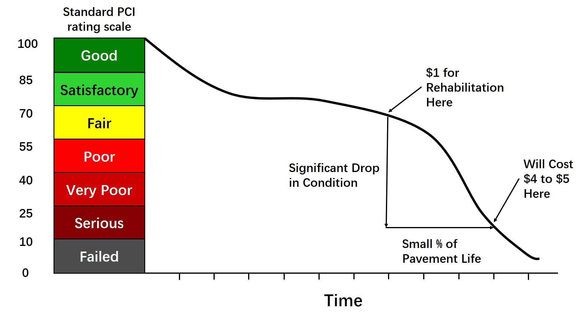

```{r setup, include=FALSE,message = FALSE,cache=TRUE}
knitr::opts_chunk$set(echo = TRUE)
```

```{r libraries, message=FALSE, warning=FALSE, results='hide'}
library(dplyr)
library(tidyverse)
library(sf)
library(lubridate)
library(tigris)
library(tidycensus)
library(ggplot2)
library(viridis)
library(riem)
library(gridExtra)
library(knitr)
library(kableExtra)
library(caret)
library(purrr)
library(FNN)
library(stargazer)
library(spatstat)
library(raster)
library(spdep)
library(grid)
library(mapview)
library(stringr)
library(ggcorrplot)
library(scales)
library(colorspace)
library(rgdal)          
library(RColorBrewer) 
library(rasterVis)    
library(sp)
library(ggpubr)
library(leaflet)
library(transformr)
library(jtools)

library(randomForest)
library(e1071)  # SVM
library(xgboost)
library(readr)
library(car)

palette_5 <- c("#0c1f3f", "#08519c", "#3bf0c0", "#e6a52f", "#e76420")
#palette_5blues <-c("#eff3ff","#bdd7e7","#6baed6","#3182bd","#08519c")
palette_4 <-c("#08519c","#3bf0c0","#e6a52f","#e76420")
palette_2 <-c("#e6a52f","#3FB0C0")
palette_3 <-c("#e6a52f","#3FB0C0", "#e76420")

palette_5_mako <- c("#0B0405", "#3E356B", "#357BA2", "#49C1AD", "#DEF5E5")
palette_2_mako <- c("#3E356B", "#49C1AD")

#show_col(viridis_pal(option="G")(5))

source("https://raw.githubusercontent.com/urbanSpatial/Public-Policy-Analytics-Landing/master/functions.r")

mapTheme <- function(base_size = 12) {
  theme(
    text = element_text( color = "black"),
    plot.title = element_text(size = 16,colour = "black"),
    plot.subtitle=element_text(face="italic"),
    plot.caption=element_text(hjust=0),
    axis.ticks = element_blank(),
    panel.background = element_blank(),axis.title = element_blank(),
    axis.text = element_blank(),
    axis.title.x = element_blank(),
    axis.title.y = element_blank(),
    panel.grid.minor = element_blank(),
    panel.border = element_rect(colour = "black", fill=NA, size=2),
    strip.text.x = element_text(size = 14))
}

plotTheme <- function(base_size = 12) {
  theme(
    text = element_text( color = "black"),
    plot.title = element_text(size = 16,colour = "black"),
    plot.subtitle = element_text(face="italic"),
    plot.caption = element_text(hjust=0),
    axis.ticks = element_blank(),
    panel.background = element_blank(),
    panel.grid.major = element_line("grey80", size = 0.1),
    panel.grid.minor = element_blank(),
    panel.border = element_rect(colour = "black", fill=NA, size=2),
    strip.background = element_rect(fill = "grey80", color = "white"),
    strip.text = element_text(size=12),
    axis.title = element_text(size=12),
    axis.text = element_text(size=10),
    plot.background = element_blank(),
    legend.background = element_blank(),
    legend.title = element_text(colour = "black", face = "italic"),
    legend.text = element_text(colour = "black", face = "italic"),
    strip.text.x = element_text(size = 14)
  )
}

```


```{r message=FALSE, warning=FALSE}
#Please download the **EDA.RData** file from [google drive](https://drive.google.com/file/d/1sr7AMW5YAfoxHK-9UVq9fOxVcafevpJp/view?usp=sharing) and put it under Data/, I've added the path to gitignore file.

# RData from EDA part, please make sure to run this properly
load("Data/EDA2.RData")

# OPTIONAL BELOW:
# modelling_0325.RData contains all the model in this Rmd file, if you do not wish to run through all the models below and just want to take a quick look at the model results, you can download the RData file here(https://drive.google.com/file/d/15yaeGVxl-Wnh78o9jxEzRJgCwMT7taa8/view?usp=sharing), save it in the corresponding root and load it. 
#load("Data/modelling_0325.RData")

# latest version containing all RF models
#load("Data/0412-2.RData")
```

# 1. Project Introduction

The city of El Paso, Texas has been experiencing tremendous growth over the past decade. With growing population comes more pressure - literally - on roads.

There is hope that passage of the Bipartisan Infrastructure Bill in congress will allow for more funding for streets and maintenance projects to help the city's road network become safer and more resilient - but the eventual funding from "Build Back Better" still leaves decision-making process of which local roads to update up to the city.

# 2. Use Case

The City of El Paso's Capital Improvement Department (Planning Division) wishes to improve their system for deciding where to allocate capital improvement funds for roadway projects. Presently, this is done by integrating spatial data sets reflecting current conditions to determine where there is need and opportunity.

There currently is not an established prioritization system when it comes to which roads to improve - or even add to the queue for improvement. PCI scores inform the decision making, but lots of the decisions are ad hoc. For example, constituents raise concerns about certain roads, the department looks at the Pavement Condition Index (PCI) score, and if it is below a certain threshold, then they add it to the list of projects for improvement. This is a very reactive process. They would like it to be more proactive.

But PCI also does not tell the whole story, and the client has expressed interest in exploring other factors that may drive a new prioritization system.

This project is two-pronged:

-   First, we have the **predictive model**. We will predict PCI based on 2018 historical data and lots of feature engineering - which we will discuss shortly. This part of the project is mostly for the exercise of modeling in the academic setting of MUSA801, but the client could always choose to integrate our model outputs of PCI into tools later on.

-   The second part of our project is the **prioritization system**, which will take the form of a we application. We will incorporate PCI (our modeled score or more likely the PCI used by the city) as just one piece of a resource application and prioritization system. We will be exploring factors to drive the new system that include both built and social environmental variables, thus bringing a lens of equity into the project.

# 3. Background Research

## 3.1. Pavement Condition Index (PCI)

A Pavement Condition Index (PCI) measures the quality of a specific road segment. The Capital Improvements Department in El Paso hired a private contractor in 2018 to conduct a digital image scan of the city's roads to evaluate them based on a wide range of conditions. While their exact metrics are proprietary, generally, PCIs are based off of factors such as presence of potholes, bumps, or cracks. The index ranges from a qualitative scale of _Failing_ to _Good_ or quantitatively _0_ to _100_. We found this chart from an Army Corps of Engineers' study in which they show a significant drop in condition of a road after a certain amount of time. We hope to include the cost savings calculations from this study in the second part of our project, the decision-making tool. This would be a strong advocacy tool for improving a road as well as a strong planning tool by considering the road's lifetime. For now, this made us curious about the construction of roads and if there are any earlier stage indicators that could show signs of weakening conditions.

```{r echo=TRUE}

```

## 3.2. Road Anatomy

To better inform our model, we wanted to understand the different parts of a road and what factors may lead to worsening conditions over time. We identified three main road anatomy-related features to pay attention to: the earth foundation, the roadbed base, and the road surface.

```{r echo=TRUE}


```

The surface as an important feature is more obvious as potholes, bumps, and cracks are noticeable to the everyday road user. However, there are roads that have no base layer, weak materials, or are built in areas prone to flooding that can weaken the road's structure as it ages. These are all important aspects of a road's anatomy that we explored in the exploratory data analysis phase and their relationship to PCI.

# 4. Exploratory Data Analysis

## 4.1 Importing Local Data

To begin, we import various data layers from local sources, and the datasets include:

-   **CIP_layer**: Centerlines included in the Capital Improvement Program
-   **centerline_with_age**: Centerlines in El Paso with the year of resurfacing and PCI values
-   **EPCenterline**: Centerlines in El Paso with properties like CLASS
-   **zoning**: El Paso city zoning
-   **potholes**: Potholes data in El Paso
-   **waze_data**: Waze traffic jam data in El Paso
-   **VMT**: Vehicle miles traveled per census blockgroup in El Paso
-   **crash18**: Crash data in El Paso in 2018
-   **roadbed_base**: Roadbed base properties of street segments
-   **roadbed_surface**: Roadbed surface properties of street segments
-   **tl_roads**: TIGER/Line shapefile with road properties in El Paso
-   **EPcity_landcover**: Landcover raster data of El Paso
-   **floodzones**: FEMA flood zone designations data of El Paso

These datasets are the basis for the future data wrangling, feature engineering, and exploratory analysis process.

## 4.2 Selected Feature Summary

We wrangled data and settled on a collection of features, shown in the table below. The far right column indicates if the feature was ultimately used in our final model.The next several subsections go into detail on how these features were wrangled and what decisions went into determining their inclusion in the modeling.

| Feature                          | Type            | Source                                                | Used in Final Model |
|----------------------------------|-------------------------------------------------------------------------|---------------------|
| Road Class                       | Categorical     | City of El Paso                                       | Yes
| Land Use                         | Categorical     | City of El Paso                                       | Yes
| Land Cover                       | Categorical     | USGS/NCLD                                             | No
| Potholes (by road length)        | Numeric         | City of El Paso                                       | Yes
| Crashes (by road length)         | Numeric         | City of El Paso                                       | Yes
| Traffic Jams (by road length)    | Numeric         | *Engineered* from Waze, via City of El Paso           | No
| Vehicle Miles Traveled (VMT)     | Numeric         | Replica, via City of El Paso                          | Yes
| Distance to Food/Drink Amenity   | Numeric         | *Engineered* from OpenStreetMap (3rd nearest neighbor)| Yes
| Distance to Car Facility Amenity | Numeric         | *Engineered* from OpenStreetMap (3rd nearest neighbor)| Yes
| Distance to Entertainment Amenity| Numeric         | *Engineered* from OpenStreetMap (3rd nearest neighbor)| Yes
| Roadbed Base                     | Categorical     | TxDOT                                                 | Yes
| Roadbed Width                    | Categorical     | TxDOT                                                 | No
| Roadbed Surface                  | Categorical     | TxDOT                                                 | Yes
| High Flood Risk Area or Not      | Binary          | *Engineered* from FEMA 2020 Preliminary Flood Zones   | Yes
| Distance to Major Intersection   | Numeric         | *Engineered* from Centerlines                         | Yes
| Distance to Hydrology            | Numeric         | *Engineered* from TIGER Hydrology Dataset             | Yes
| Distance to Major Arterial       | Numeric         | *Engineered* from Centerlines and Census TIGER Lines  | Yes

_Internal Note for Jenna: Check EPCenterline_final to check which other base layer feature we included or not (planning zone? MAX_width? resurfacing year? road age?)_

## 4.2 Census Data

We extracted data from US Census datasets, including the American Community Survey (ACS) and TIGER/Lines national datasets, during our feature engineering process. 

_NOTE: While demographic and socioeconomic data from the ACES was not ultimately included in our model, it is useful for understanding the project context._

### 4.2.1 El Paso Demographics (Race, Ethnicity, Age data from 2019 5yr ACS)

To get a better sense of the population that the roads are servicing, we take a look at the residents' race, ethnicity, and age group through the ACS 2019 5-year dataset.

Taking a look at the population pyramid, we can tell the age structure of El Paso city tends to be young, and the working age population accounts for a large proportion of the total population, which means there is a high everyday commute demand in our study area.


```{r plot the poplation pyramid, message=FALSE, warning=FALSE}
ggplot(pop_pyramid, aes(x = variable, fill = Sex,
                 y = ifelse(test = Sex == "Male",
                            yes = -value, no = value))) + 
  geom_bar(stat = "identity") +
  # geom_line(aes(x = "15 to 19 years"), color = "red", size=1) +
  scale_y_continuous(labels = abs, limits = max(pop_pyramid$value) * c(-1,1)) +
  scale_fill_manual(values=palette_2_mako)+
  labs(title = "Population Pyramid", x = "Age Group", y = "Population by Gender") +
  coord_flip() + plotTheme()
```

The diverse distribution of race and ethnicity can serve as a reference on equity control and inform the development of the prioritization system web application tool later on. 

```{r census_demo_maps, message=FALSE, warning=FALSE}
#plotting census demographics data
#race map

race_long <- EP_race%>%
  dplyr::select(GEOID,NAME, pctWhite, pctBlack, -pctNAT, pctAsian, pctPI, pctOther, pctTwo_plus)%>%
  gather(variable, value, -geometry, -GEOID, -NAME)

race_vars <- unique(race_long$variable)
mapList <- list()

for(i in race_vars){
  mapList[[i]] <-
    ggplot() +
      geom_sf(data = filter(race_long, variable == i), aes(fill=value), colour=NA) +
      scale_fill_viridis(option='G',name="") +
      labs(title=i) +
      mapTheme()}

do.call(grid.arrange,c(mapList, ncol = 3, top = "Race by Census Tract"))


```

```{r census_demo_maps2, message=FALSE, warning=FALSE}
#ethnicity map - Hispanic or Latino
ggplot()+
  geom_sf(data=EP_ethnicity, aes(fill=pctHL), color="grey")+
  scale_fill_viridis(option='G', direction=-1)+
  labs(title="Percent Hispanic or Latino in 2019",
       fill="% Hispanic \nor Latino",
       subtitle="Census Tracts in El Paso, TX",
       caption = "Source: US Census, ACS 2019\nGray ") + mapTheme()

```

### 4.2.2 El Paso Socioeconomics (data from 2019 5yr ACS)

We also extract some socioeconomic variables from the ACS data.

Median household income also has an impact on the local infrastructure construction and repair. Furthermore, it is a good way to examine the equity of resource allocation by checking the difference between high- and low-income tracts.


```{r census_socioecon_hhincome_map, message=FALSE, warning=FALSE}
#Median household income
ggplot()+
  geom_sf(data=EP_econ, aes(fill=med_hh_income), color="grey")+
  scale_fill_viridis(option='G', direction=-1)+
  labs(title="Median Household Income in 2019",
       fill="Dollars ($)",
       subtitle="Census Tracts in El Paso, TX", caption="Source: US Census, ACS 2019\n\nNote: Gray tracts indicate no data") + mapTheme()
```

Median rent can reflect the state of the community's infrastructure to some extent and pavement condition is an important part of the local infrastructure. Thus, we assume that the median rent can somewhat reveal the local pavement conditions and serve as a reference for our decision making process.

```{r census_socioecon_medianrent_map, message=FALSE, warning=FALSE}
#Median rent
ggplot()+
  geom_sf(data=EP_econ, aes(fill=med_rent), color="grey")+
  scale_fill_viridis(option='G', direction= -1)+
  labs(title="Median Rent in 2019",
       fill="Dollars ($)",
       subtitle="Census Tracts in El Paso, TX", caption="Source: US Census, ACS 2019\n\nNote: Gray tracts indicate no data") + mapTheme()
```

The percentage of local population who takes public transit to work has a lower level of usage on the pavements nearby. By looking at this feature, we can get a basic sense of the local public transportation utilization.

```{r census_socioecon_transport_map, message=FALSE, warning=FALSE}
#pct transport to work map
ggplot()+
  geom_sf(data=EP_econ, aes(fill=pct_transport_to_work), color="grey")+
  scale_fill_viridis(option='G', direction=-1)+
  labs(title="Percent Population with Transportation to Work in 2019",
       fill="% Transport \nto Work",
       subtitle="Census Tracts in El Paso, TX", caption="Source: US Census, ACS 2019") + mapTheme()
```

### 4.2.3 El Paso Hydrology (US Census - TIGER/Line Shapefiles)

At this point, we also import the hydrology features from the US Census. We can see from the map below that El Paso does not have an extensive hydrology network, and water is concentrated mostly to the southwestern border of the city.

```{r visualize hydrology, message=FALSE, warning=FALSE}
ggplot()+
  geom_sf(data=El_Paso_city, aes(), color="grey")+
  geom_sf(data = EPhydrology, color = '#357BA2', alpha = 0.9, show.legend = T)+ 
  labs(title="Hydrology Across the City",
       subtitle="El Paso, TX", caption="Source: US Census - TIGER/Line Shapefiles") + mapTheme()

```

## 4.3 Data Wrangling and Feature Engineering

### 4.3.1 Outcome Variable: PCI

#### Centerline and PCI Exploration

In this part, we start diving deeper into the existing base data provided by the City of El Paso.
We apply data cleaning and wrangling on the `EPCenterline` data layer, such as:
- Removing some unneeded columns to keep the data frame tidy and readable
- Clipping the data layer to the city level to focus more on our study area
- Removing some duplicated **LOCAL** classes
- Combining similar road classes, per client request

After speaking to our client, we only keep four pavement categories that fall under teh city's jurisdiction for maintenance - **LOCAL**, **MINOR**, **MAJOR**, and **COLLECTOR**. We can see that most of the segments belong to the **LOCAL** category.

```{r EP centerlines ggplots, message=FALSE, warning=FALSE}
ggplot() +
  geom_sf(data = EPCenterline, aes(color = CLASS), alpha=0.8, size=0.6, show.legend = "line") +
  scale_color_manual(values=palette_4)+
  labs(title = "Road Centerlines by Class",
       fill="Class",
       subtitle = "El Paso, TX") + mapTheme()

```

We prepare road centerline data with PCI values from 2018 and the latest resurfacing year by joining `EPCenterline` to `centerline_with_age`. We add a column of index for each pavement segment at this stage for any future joins and spatial joins. Since we select pavement segments as one of our spatial units, we calculate the length of each segment as a feature for future application.

Here we focus on fundamental visualizations on the features of `EPCenterline_with_PCI`. As is shown in the plots below, **LOCAL** and **COLLECTOR** segments have higher average PCI values, while segments in **MAJOR** class tend to have more problems in pavement condition. When it comes to different planning areas, segments in Northwest El Paso and the Art Craft region have better pavement conditions, while the central region performs poorly.

```{r explore centerline data with PCI values from 2018 with visuals, message=FALSE, warning=FALSE}

ggplot(EPCenterline_with_PCI, aes(y=CLASS)) +
  geom_bar(width=0.5, color="black", fill = "#357BA2") +
  labs(title = "Road Centerlines by Class",
       y="Class",
       x="Count",
       subtitle = "El Paso, TX") + plotTheme()

```

We plot the histogram of the PCI distribution for the cleaned dataset shown below, and we can detect some negative PCI values from the plot. According to our client, these negative PCI scores are assignment to segements that are highways, interstates, private roads, etc., which are out of the project scope. After removing segments with negative PCIs, we get a new PCI distribution, which shows three peaks in numbers at the value ranges of **98-100**, **80-85**, and **58-63**.

```{r centerline with pci, message=FALSE, warning=FALSE}
# glimpse(centerline_with_age)

# unique(center_line$PCI_2018)
ggplot(EPCenterline_with_PCI, aes(y=PCI_2018), color="grey") +
  geom_bar(width=0.6, color="transparent", fill = "#357BA2") +
  labs(title = "PCI 2018 Score Distribution",
       x="Count",
       y="PCI",
       subtitle = "El Paso, TX") + plotTheme()

```

We also map the segments colored by PCI score to see the spatial distribution of scores across the city. Higher scores - denoted by the darker purples - tend to be located towards the outer edges of the city, especially to the eastern portions.

_JE NOTE: Add a mapview version of this map for interactive and legibility, if time_

```{r centerlines with pci map, message=FALSE, warning=FALSE}
ggplot()+
  geom_sf(data = El_Paso_city, fill="transparent", color="grey") +
  geom_sf(data = EPCenterline_with_PCI, aes(color = PCI_2018)) +
  scale_color_viridis(option='G', direction=-1)+
  labs(title = "Road Centerlines with PCI Value in 2018",
       caption= "Source: City of El Paso, TX",
       color="PCI",
       subtitle = "El Paso, TX") + mapTheme()
```

### 4.3.2 Waze Jams

To get the X and Y coordinates for the traffic jam data from Waze, we apply string extraction on the raw `waze_data` dataset and build up a spatial data frame.

As is shown in the histogram below, most of the traffic jams collected in the Waze jams dataset are heavy and moderate traffic jams, with a few NAs and very few categorized as light traffic. This is probably because people do not tend to report light traffic to the Waze application. The map of Waze data points below reveals that most of the congestion occurs along the main roads in the city.

_Note: We elected to remove the NA subtype from the Waze jams data going forward since we are interested in the jam traffic report subtypes only._

```{r message=FALSE, warning=FALSE}
ggplot(waze_sf, aes(y=Subtype)) +
  geom_bar(width=0.5, color="black", fill = "#357BA2") +
  labs(title = "Waze Jams Count by Subtype",
       x="Count",
       y="Jam Subtype",
       subtitle = "El Paso, TX") + plotTheme()
```

### 4.3.3 Potholes

To wrangle the potholes data, we first assign spatial coordinates to the data points with our coordinate references system and remove NA rows. Then we filter out some incorrectly recorded data and group the potholes data by year. We make the maps of the pothole data points of 2016-2018 and 2019-2021 below, and plot the distribution of pothole numbers by year.

```{r lots of potholes maps, message=FALSE, warning=FALSE}
# 2016-2018 map
potholes_2016to2018_map <- ggplot() +
  geom_sf(data = El_Paso_city, fill="grey") +
  geom_sf(data = potholes_sf_2016to2018, aes(), color="#357BA2", size=0.3, alpha=0.8) +
  labs(title = "Potholes in 2016-2018",
       subtitle = "El Paso, TX") + mapTheme()

#  2019-2021 map
potholes_2019to2021_map <- ggplot() +
  geom_sf(data = El_Paso_city, fill="grey") +
  geom_sf(data = potholes_sf_2019to2021, aes(), color="#357BA2", size=0.3, alpha=0.8) +
  labs(title = "Potholes in 2019-2021",
       subtitle = "El Paso, TX") + mapTheme()

grid.arrange(potholes_2016to2018_map, potholes_2019to2021_map, ncol= 2)
```

```{r potholes by year, message=FALSE, warning=FALSE}

potholes_years <- c("2016", "2017", "2018", "2019", "2020", "2021")

potholes_sf_filtered <- potholes_sf %>% dplyr::filter(YEAR %in% potholes_years)

ggplot(potholes_sf_filtered, aes(y=YEAR)) +
  geom_bar(width=0.5, color="black", fill = "#357BA2") +
  labs(title = "Potholes by Year",
       subtitle = "El Paso, TX") + plotTheme()
```

### 4.3.4 Land Cover & Land Use

Direct and surrounding land cover and land use types can influence road conditions. Most of the roads fall within heavily developed areas and are single family land use. These characteristics indicate that there could be high volume of traffic as people travel from residential to commercial areas, which ultimately increases the wear and tear of roads over time.

```{r map the final land cover raster with all groups, message=FALSE, warning=FALSE}
ggplot() +
  geom_sf(data=EPCenterline_with_PCI, aes()) +
  geom_raster(data = EPcity_landcover_df, aes(x = x, y = y, fill = as.character(value))) + 
  scale_fill_manual(name = "Land Cover",
                    values = LCcolors,
                    labels = LCnames[-2],
                    na.translate = FALSE) +
  coord_sf(expand = F) +
  theme(axis.title.x = element_blank(),
        axis.title.y = element_blank(),
        panel.background = element_rect(fill = "white", color = "black")) + 
  labs(title = "Land Cover in 2018",
       caption = "Source: National Land Cover Database; City of El Paso, TX",
       subtitle = "El Paso, TX | Road Centerlines in Black") +
  mapTheme()

```

Again we can see that there is majority developed area across the city, with a focus particularly on single-family residential areas.

```{r land use ggplots, message=FALSE, warning=FALSE}
ggplot() +
  geom_sf(data = land_use_majority_sf, aes(fill = land_use_type), color="grey") +
  scale_fill_viridis_d(option="mako", direction=-1) +
                     labs(title = "Land Use by Census Tract",
       fill= "Land Use Type \n(Majority)",
        caption="Source: City of El Paso, TX",
       subtitle = "El Paso, TX") +
  mapTheme()

ggplot(land_use_majority_sf, aes(y=land_use_type)) +
  geom_bar(width=0.5, color="black", fill = "#357BA2") +
  labs(title = "Land Use by Census Tract",
       y="Land Use Type",
       x="Count of Tracts",
       subtitle = "El Paso, TX",
       caption="Source: City of El Paso, TX") +
  plotTheme()

```

### 4.3.5 OpenStreetMap Amenities

We gather features marked as an *amenity* from OpenStreetMap. We filter to the following broad amenity categorizes to include in our exploration:

- **Food & Drink** ('restaurant', 'fast_food', 'cafe', 'bar', 'ice_cream', 'pub')
- **Entertainment** ('arts_centre', 'cinema', 'theatre')
- **Car-Related Facility** ('fuel', 'car_rental', 'car_wash', 'parking', 'parking_space')


```{r load amentiy data from outside source, message=FALSE, warning=FALSE}
amenity <- read.csv("Data/OSM_amenities/OSM_amenity.csv")

amenity_sf <- 
  amenity %>%
  st_as_sf(coords = c("lon", "lat"), crs = 4326, agr = "constant") %>%
  st_transform('ESRI:102339')
```

```{r plot the amenities, message=FALSE, warning=FALSE}
ggplot(amenity_sf, aes(y=amenity)) +
  geom_bar(width=0.5, color="black", fill = "#357BA2") +
  labs(title = "OpenStreetMap Amenities by Type",
       x="Count",
       y="Type",
       subtitle = "El Paso, TX") + plotTheme()
```


```{r divide amenities to different categories, message=FALSE, warning=FALSE}
food_drink <- c('restaurant', 'fast_food', 'cafe', 'bar', 'ice_cream', 'pub')
entertainment <- c('arts_centre', 'cinema', 'theatre')
car_facility <- c('fuel', 'car_rental', 'car_wash', 'parking', 'parking_space')

am_food_drink <- amenity_sf %>%
  filter(amenity %in% food_drink)
am_entertainment <- amenity_sf %>%
  filter(amenity %in% entertainment)
am_car_facility <- amenity_sf %>%
  filter(amenity %in% car_facility)

# KNN function, join amenities
st_c <- st_coordinates
EPCenterline_new6 <-
  EPCenterline_new5 %>%
  mutate(
      food_drink_nn3 = nn_function(na.omit(st_c(st_centroid(EPCenterline_new5))),na.omit(st_c(am_food_drink)), 3),
      entertainment_nn3 = nn_function(na.omit(st_c(st_centroid(EPCenterline_new5))),na.omit(st_c(am_entertainment)), 3),
      car_facility_nn3 = nn_function(na.omit(st_c(st_centroid(EPCenterline_new5))),na.omit(st_c(am_car_facility)), 3),
  )

```

```{r osm amenities maps, message=FALSE, warning=FALSE}
#palette_5_mako <- c("#0B0405", "#3E356B", "#357BA2", "#49C1AD", "#DEF5E5")

osm_fooddrink_map <- ggplot() +
  geom_sf(data = El_Paso_city, color = "grey") +
  geom_sf(data = am_food_drink, aes(), color="#3E356B", size=0.75, show.legend = "point") +
  labs(title = "Food & Drink",
       subtitle = "El Paso, TX", caption = "Source: OpenStreetMap")+
  mapTheme()

osm_entertainment_map <- ggplot() +
  geom_sf(data = El_Paso_city, color = "grey") +
  geom_sf(data = am_entertainment, aes(), color="#357BA2", size=0.75, show.legend = "point") +
  labs(title = "Entertainment",
       subtitle = "El Paso, TX", caption = "Source: OpenStreetMap")+
  mapTheme()

osm_carfacility_map <- ggplot() +
  geom_sf(data = El_Paso_city, color = "grey") +
  geom_sf(data = am_car_facility, aes(), color="#49C1AD", size=0.75, show.legend = "point") +
  labs(title = "Car-Related Facilities",
       subtitle = "El Paso, TX", caption = "Source: OpenStreetMap")+
  mapTheme()

grid.arrange(osm_fooddrink_map, osm_entertainment_map, osm_carfacility_map, ncol=3, top="Select OpenStreetMap Amenities")
```

At this point, we also calculate the third nearest neighbors to use as the engineered features. _JE NOTE: add more on why we chose to do 3rd_

### 4.3.6 High Risk Flood Zones

We obtained the new preliminary FEMA flood zone maps from the City of El Paso.

```{r bring in the 2020 preliminary flood zone data and clip, eval=FALSE, message=FALSE, warning=FALSE}
prelim_floodzones_2020 <- st_read("Data/PrelimFloodZone2020/PrelimFloodZone2020.shp" )%>%
  st_transform('ESRI:102339')

# clip flood zones to city bounds
EPcity_prelim_floodzones_2020 <- st_intersection(prelim_floodzones_2020, El_Paso_city)

EPcity_prelim_floodzones_2020 <- EPcity_prelim_floodzones_2020 %>% dplyr::filter(EPcity_prelim_floodzones_2020$STUDY_TYP == "SFHAs WITH HIGH FLOOD RISK")

```

```{r visualize flood zones, message=FALSE, warning=FALSE}
ggplot()+
  geom_sf(data=El_Paso_city, aes(), color="grey")+
  geom_sf(data = EPcity_prelim_floodzones_2020, aes(fill=STUDY_TYP), color="transparent", fill="#3FB0C0")+
  #scale_fill_viridis_d(direction=-1, option='G')+
  labs(title="Preliminary Flood Zone 2020: Area of High Flood Risk",
       fill= "",
       subtitle="El Paso, TX", caption="Source: City of El Paso; FEMA") + mapTheme()

```

```{r flood zones by high risk, message=FALSE, warning=FALSE}
EPCenterline_new6 <- EPCenterline_new6 %>% mutate(n_floodzone_int = lengths(st_intersects(EPCenterline_new6, EPcity_prelim_floodzones_2020)))

# adding a column for yes or no for if intersected a flood zone area at all or not
EPCenterline_new6 <-
  EPCenterline_new6 %>%
  mutate(floodzone_highrisk = ifelse(EPCenterline_new6$n_floodzone_int > 0, "Yes", "No"))
```

### 4.3.7 Crashes

```{r udpated crash data according to year, eval=FALSE, message=FALSE, warning=FALSE}
#read in new data
crash16 <- st_read("Data/CRIS2016/CRIS2016.shp")
crash17<- st_read("Data/CRIS2017/CRIS2017.shp")
crash19<- st_read("Data/CRIS2019/CRIS2019.shp")
crash20<- st_read("Data/CRIS2020/CRIS2020.shp")
crash21<- st_read("Data/CRIS2021/CRIS2021.shp")

#combine past years
crash16_18 <- rbind(crash16, crash17, crash18)
crash19_21 <- rbind(crash19, crash20, crash21)

#replace 0s in lat long columns with NA so we can omit
crash16_18trim<-crash16_18[!(crash16_18$Latitude==0 | crash16_18$Longitude==0),]
crash19_21trim<-crash19_21[!(crash19_21$Latitude==0 | crash19_21$Longitude==0),]

#transforming to our crs
crash16_18sf <- crash16_18trim %>%
  na.omit() %>%
  st_as_sf(coords = c("Latitude", "Longitude"),
           crs = 'epsg:2277',
           agr = "constant") %>%
  st_transform('ESRI:102339')

crash19_21sf <- crash19_21trim %>%
  na.omit() %>%
  st_as_sf(coords = c("Latitude", "Longitude"),
           crs = 'epsg:2277',
           agr = "constant") %>%
  st_transform('ESRI:102339')
```

```{r join crash data to EPcenterline, message=FALSE, warning=FALSE}
#join crashes to EPCenterline using nearest feature 
crash_centerlines16_18 <-  st_join(crash16_18sf, EPCenterline_buffer, join = st_nearest_feature)
crash_centerlines19_21 <-  st_join(crash19_21sf, EPCenterline_buffer, join = st_nearest_feature)

#clean up to make it easier
crash_centerlines_clean16_18 <- crash_centerlines16_18 %>%
  dplyr::select(Crash_ID, index) %>% st_drop_geometry()

crash_centerlines_clean19_21 <- crash_centerlines19_21 %>%
  dplyr::select(Crash_ID, index) %>% st_drop_geometry()

#drop old columns
EPCenterline_new6 <- subset(EPCenterline_new6, select= -c(crash_count,crash_len))

# count crashes per street segment
crash_groupings16_18 <- crash_centerlines_clean16_18 %>%
  group_by(index) %>%
  summarize(crash_count16_18=n())

crash_groupings19_21 <- crash_centerlines_clean19_21 %>%
group_by(index) %>%
summarize(crash_count19_21=n())

# for 2016-2018...

# then join back to initial EPCenterline using index as the ID
EPCenterline_new6 <- merge(EPCenterline_new6, crash_groupings16_18, by = "index", all.x=TRUE)

# replace NAs in crash count column with 0
EPCenterline_new6$crash_count16_18[is.na(EPCenterline_new6$crash_count16_18)] <- 0

# calculate crashes per 100 meters
EPCenterline_new6 <-
  EPCenterline_new6 %>%
  mutate(crash_len16_18 = crash_count16_18*100/pave_length)

# convert to numeric
EPCenterline_new6$crash_len16_18 <- as.numeric(as.character(EPCenterline_new6$crash_len16_18))

# then again for 2019-2021...
# then join back to initial EPCenterline using index as the ID
EPCenterline_new6 <- merge(EPCenterline_new6, crash_groupings19_21, by = "index", all.x=TRUE)

# replace NAs in crash count column with 0
EPCenterline_new6$crash_count19_21[is.na(EPCenterline_new6$crash_count19_21)] <- 0

# calculate crashes per 100 meters
EPCenterline_new6 <-
  EPCenterline_new6 %>%
  mutate(crash_len19_21 = crash_count19_21*100/pave_length)

# convert to crash_len19_21
EPCenterline_new6$crash_len19_21 <- as.numeric(as.character(EPCenterline_new6$crash_len19_21))
```

### 4.3.8 Roadbed Features

Add new plots.

```{r join roadbed feats to centerlines, message=TRUE, warning=TRUE}
#rename target column and drop unneccessary columns
#roadbed_base_PCI <- roadbed_base_PCI %>%
#  mutate(rb_base = BASE_TYPE_)%>%
#  dplyr::select(index, rb_base)%>%
#  st_drop_geometry()

#roadbed_surface_PCI <- roadbed_surface_PCI %>%
#  mutate(rb_surface = SRFC_TYPE)%>%
#  dplyr::select(index, rb_surface)%>%
#  st_drop_geometry()

#get rid of duplicates - selecting first value of the group (duplicates have same value)
roadbed_base_PCI <- roadbed_base_PCI %>%
  rename(rb_base = BASE_TYPE_) %>%
  group_by(index)%>%
  summarize(rb_base = first(rb_base))

roadbed_surface_PCI <- roadbed_surface_PCI %>%
  rename(rb_surface = SRFC_TYPE) %>%
  group_by(index)%>%
  summarize(rb_surface = first(rb_surface))

roadbed_surface_PCI$rb_surface <- str_to_title(roadbed_surface_PCI$rb_surface)

#join to EPCenterline_new6
EPCenterline_new6 <- left_join(EPCenterline_new6, roadbed_base_PCI %>% st_drop_geometry(), on="index")
EPCenterline_new6 <- left_join(EPCenterline_new6, roadbed_surface_PCI %>% st_drop_geometry(), on="index")

#change NA values to unknown category
EPCenterline_new6[,c("rb_base","rb_surface")][is.na(EPCenterline_new6[,c("rb_base","rb_surface")])] <- "Unknown"
```

```{r update potholes feature, message=FALSE, warning=FALSE}
## Potholes Update
#Creating new columns for potholes counts and lengths for the two different year groupings.

#drop old columns
EPCenterline_new6 <- subset(EPCenterline_new6, select= -c(potholes_count, potholes_len))

#clean up potholes grouping dfs
potholes_sf_2016to2018 <- subset(potholes_sf_2016to2018, select= c(YEAR, geometry, WORKORDERID))
potholes_sf_2019to2021 <- subset(potholes_sf_2019to2021, select= c(YEAR, geometry, WORKORDERID))

# join potholes to df

#join potholes to EPCenterline using nearest feature 
potholes_centerlines_2016to2018 <-  st_join(potholes_sf_2016to2018, EPCenterline_buffer, join = st_nearest_feature)
potholes_centerlines_2019to2021 <-  st_join(potholes_sf_2019to2021, EPCenterline_buffer, join = st_nearest_feature)

#clean up to make it easier
potholes_centerlines_clean_2016to2018 <- potholes_centerlines_2016to2018 %>%
  dplyr::select(WORKORDERID, index) %>% st_drop_geometry()

potholes_centerlines_clean_2019to2021 <- potholes_centerlines_2019to2021 %>%
  dplyr::select(WORKORDERID, index) %>% st_drop_geometry()

# count potholes per street segment
potholes_groupings_2016to2018 <- potholes_centerlines_clean_2016to2018 %>%
  group_by(index) %>%
  summarize(potholes_count16_18=n())

potholes_groupings_2019to2021 <- potholes_centerlines_clean_2019to2021 %>%
group_by(index) %>%
summarize(potholes_count19_21=n())

# then join back to initial EPCenterline using index as the ID
EPCenterline_new6 <- merge(EPCenterline_new6, potholes_groupings_2016to2018, by = "index", all.x=TRUE)

# replace NAs in potholes count column with 0
EPCenterline_new6$potholes_count16_18[is.na(EPCenterline_new6$potholes_count16_18)] <- 0

# calculate potholes per 100 meters
EPCenterline_new6 <-
  EPCenterline_new6 %>%
  mutate(potholes_len16_18 = potholes_count16_18*100/pave_length)

# convert to numeric
EPCenterline_new6$potholes_len16_18 <- as.numeric(as.character(EPCenterline_new6$potholes_len16_18))

# for 2019-2021...

# then join back to initial EPCenterline using index as the ID
EPCenterline_new6 <- merge(EPCenterline_new6, potholes_groupings_2019to2021, by = "index", all.x=TRUE)

# replace NAs in potholes count column with 0
EPCenterline_new6$potholes_count19_21[is.na(EPCenterline_new6$potholes_count19_21)] <- 0

# calculate potholes per 100 meters
EPCenterline_new6 <-
  EPCenterline_new6 %>%
  mutate(potholes_len19_21 = potholes_count19_21*100/pave_length)

# convert to numeric
EPCenterline_new6$potholes_len19_21 <- as.numeric(as.character(EPCenterline_new6$potholes_len19_21))
```

```{r add functional classification data, message=FALSE, warning=FALSE}
func_class <- st_read("Data/ElPaso_Func_Class/ElPaso_Func_Class.shp")%>%
  st_transform('ESRI:102339')

major_FCs <- c("Major Collector", "Principal Arterial - Other", "Interstate", "Principal Arterial - (Other Freeways and Expressways)")

major_arterials <- func_class%>%
  filter(FC_DESC == major_FCs)

#return index of nearest feat in major_arterials to each feature in EPCenterline
nearest_major_arterial <- st_nearest_feature(EPCenterline_new6, major_arterials) 

EPCenterline_new7 <- EPCenterline_new6 %>%
  mutate(dist_major_arterial = st_distance(EPCenterline_new6, major_arterials[nearest_major_arterial,], by_element=TRUE))
```

## 4.4 Variable Relationships

We split data according to year groupings before running some correlations analyses to understand relationships between PCI and our features.

```{r refine epcenterline_new7 to 8 and additional cleanup, message=FALSE, warning=FALSE}
#make sure measurement variables are numeric BEFORE THE SPLIT
EPCenterline_new7$dist_hydro <- as.numeric(as.character(EPCenterline_new7$dist_hydro))
EPCenterline_new7$dist_major_int <- as.numeric(as.character(EPCenterline_new7$dist_major_int))
EPCenterline_new7$pave_length <- as.numeric(as.character(EPCenterline_new7$pave_length))

# NEW - additional data cleanup
EPCenterline_new7 <- EPCenterline_new7 %>% dplyr::select(-CNTY_SEAT_FLAG)

#EPCenterline_new8 created
EPCenterline_new8 <- 
  EPCenterline_new7 %>% 
  dplyr::select(-StreetName_EP, -StreetName_Age, -STYPE, -MUNR, -STS, -DLU,
                -RoadLevel, -SURFTYPE, -OBJECTID, -GID, -CITY_NM, -TXDOT_CITY_NBR,
                -CITY_FIPS, -COLOR_CD, -POP1990, -POP2000, -POP2010, -POP2020, -POP_CD,
                -GEOID.y, -Res_Year, -Max_YEAR_F, -New_Width) %>%
  rename(NAME_census = NAME, GEOID = GEOID.x)
# glimpse(EPCenterline_new8)

# Change data column types
EPCenterline_new8$CLASS <- as.factor(EPCenterline_new8$CLASS)
EPCenterline_new8$land_use_type <- as.factor(EPCenterline_new8$land_use_type)
EPCenterline_new8$floodzone_highrisk <- as.factor(EPCenterline_new8$floodzone_highrisk)
EPCenterline_new8$rb_base <- as.factor(EPCenterline_new8$rb_base)
EPCenterline_new8$rb_surface <- as.factor(EPCenterline_new8$rb_surface)

EPCenterline_new8$dist_major_arterial <- as.numeric(as.character(EPCenterline_new8$dist_major_arterial))

```


```{r EPCenterline data splits, eval=FALSE, message=FALSE, warning=FALSE, include=FALSE}
# SPLIT THE DATA

# 2016-2018
EPCenterline_2016to2018<- subset(EPCenterline_new8, select= -c(crash_count19_21, crash_len19_21, potholes_count19_21,potholes_len19_21))

# 2019-2021
EPCenterline_2019to2021 <- subset(EPCenterline_new8, select= -c(crash_count16_18, crash_len16_18, potholes_count16_18,potholes_len16_18, PCI_2018))

```

```{r RENAME}
# RENAME THE YEAR SPECIFIC COLUMNS TO BE NAMED THE SAME AFTER THE SPLIT

EPCenterline_2016to2018 <- EPCenterline_2016to2018 %>%
  dplyr::rename(crash_count= crash_count16_18,
                crash_len = crash_len16_18,
                potholes_count = potholes_count16_18,
                potholes_len = potholes_len16_18)


EPCenterline_2019to2021 <- EPCenterline_2019to2021 %>%
  dplyr::rename(crash_count= crash_count19_21,
                crash_len = crash_len19_21,
                potholes_count = potholes_count19_21,
                potholes_len = potholes_len19_21)

```

### 4.4.1 Numeric Variable Correlations for 2016-2018 Grouping

```{r Numeric Correlations with PCI, warning=FALSE}
numVars_PCI <-
  EPCenterline_2016to2018 %>%
  dplyr::select(VMT_pop, PCI_2018,
    road_age, potholes_count, crash_count,
    #crash_len16_18, #potholes_len16_18, waze_len
    dist_hydro, dist_major_int) %>%
  st_drop_geometry() %>%
  na.omit()

numVars_PCI %>% 
  gather(Variable, Value, -PCI_2018) %>% 
  ggplot(aes(Value, PCI_2018)) +
  geom_point(size = 0.5, color = "grey") + 
  geom_smooth(method = "lm", se=F, colour = "#3FB0C0") +
     facet_wrap(~Variable, ncol = 3, scales = "free") +
     labs(title = "Numeric Variables vs. PCI",
          subtitle = "El Paso, TX") + 
  stat_cor(aes(label = ..r.label..), label.x = 0) +
  plotTheme()

```

### 4.4.2 Categorical Correlations with PCI

We also examine the correlations of PCI values and some categorical variables.

#### Road Class and PCI

When it comes to the road class of pavement segments in the EPCenterline dataset, there is no obvious difference between different road classes. Thus, road class might not be a useful variable in our model.

```{r class pci correlation, message=FALSE, warning=FALSE}

class_PCI<- EPCenterline_2016to2018[c('index','CLASS','PCI_2018')]

class_PCI %>%
ggplot(aes(CLASS, PCI_2018)) +
     geom_bar(position = "dodge", stat = "summary", fun = "mean", fill="#357BA2") +  
    labs(title = "Road Class vs. PCI",
         y="PCI Score in 2018",
         x="Road Class",
         subtitle = "Dataset: EPCenterline")  + plotTheme()
```

#### Roadbed Base Material and PCI

For the roadbed base material feature come from TXDOT roadbed data layer, we can tell that pavements with no base layer have the highest average PCI and those with asphalt stabilized base and stabilized open-graded permeable pavement have lower PCI values.

```{r roadbed base pci correlation, warning=FALSE}
roadbed_base_PCI<- EPCenterline_2016to2018[c('index','rb_base','PCI_2018')]

roadbed_base_PCI %>%
ggplot(aes(rb_base, PCI_2018)) +
     geom_bar(position = "dodge", stat = "summary", fun = "mean", fill="#357BA2") +  
    labs(title = "Roadbed Base Material vs. PCI",
         y="PCI Score in 2018",
         x="Roadbed Base Material",
         subtitle = "Dataset: TXDOT Roadbed_Base") +
   scale_x_discrete(labels = wrap_format(10)) + 
  plotTheme()
```

#### Roadbed Surface Material and PCI

For the roadbed surface material feature, pavement segments with joined reinforced concrete surface have the highest average PCI, while those with continuously reinforced concrete surface, medium thickness asphaltic concrete surface have lower average PCI values.

```{r roadbed surface pci correlation, warning=FALSE}
roadbed_surface_PCI<- EPCenterline_2016to2018[c('index','rb_surface','PCI_2018')]

roadbed_surface_PCI %>%
ggplot(aes(rb_surface, PCI_2018)) +
    geom_bar(position = "dodge", stat = "summary", fun = "mean", fill="#357BA2") +  
    labs(title = "Roadbed Surface Material vs. PCI",
         y="PCI Score in 2018",
         x="Roadbed Surface Material",
         subtitle = "Dataset: TXDOT Roadbed_Surface") +
   scale_x_discrete(labels = wrap_format(19)) + 
  theme(axis.text.x = element_text(angle = 45, hjust = 1))+
    plotTheme()
```

#### Land Use and PCI

Looking into the relationship between land use types and PCI value, we find that pavement segments near open space, transportation, and other land use types have higher PCIs, with an average over 75. Meanwhile, segments near multi-family houses, non-retail attractions have lower average PCIs.

```{r land use pci correlation, eval=FALSE, message=FALSE, warning=FALSE, include=FALSE}
land_use_with_PCI<- EPCenterline_2016to2018[c('index','land_use_type','PCI_2018')]%>%
  na.omit()

land_use_with_PCI$land_use_type = stringr::str_replace_all(land_use_with_PCI$land_use_type, "_", " ")

land_use_with_PCI %>%
ggplot(aes(land_use_type, PCI_2018)) +
     geom_bar(position = "dodge", stat = "summary", fun = "mean", fill="#357BA2") +  
    labs(title = "Land Use vs. PCI",
         y="PCI Score in 2018",
         x="Land Use Type",
         subtitle = "Dataset: El Paso Land Use") +
  scale_x_discrete(labels = wrap_format(12)) + 
   plotTheme()

```

### 4.4.3 Variable Transformations

Looking at the variable distributions, we decided to explore some transformations. We looking across the distributions of numeric variables to get a sense of how they each look.

```{r distribution of predictors, eval=FALSE, message=FALSE, warning=FALSE, include=FALSE}
# Looking across the distributions of numeric variables to get a sense of how they each look. Visualized below are a few of them.
EP_model <- EPCenterline_2016to2018 %>% na.omit()

#hist(EP_model$crash_len16_18)
#hist(EP_model$potholes_len16_18)

#hist(EP_model$car_facility_nn3)
#hist(EP_model$entertainment_nn3)
#hist(EP_model$food_drink_nn3)

hist1 <- ggplot(EP_model, aes(x=road_age)) + geom_histogram(fill="#357BA2") + plotTheme()
hist2 <-  ggplot(EP_model, aes(x=VMT_pop)) + geom_histogram(fill="#357BA2") + plotTheme()
hist3 <- ggplot(EP_model, aes(x=dist_hydro)) + geom_histogram(fill="#357BA2") + plotTheme()
hist4 <- ggplot(EP_model, aes(x=dist_major_int)) + geom_histogram(fill="#357BA2") + plotTheme()
hist5 <- ggplot(EP_model, aes(x=crash_len)) + geom_histogram(fill="#357BA2") + plotTheme()
hist6 <- ggplot(EP_model, aes(x=potholes_len)) + geom_histogram(fill="#357BA2") + plotTheme() 

hists <- c("hist1", "hist2", "hist3", "hist4", "hist5", "hist6")

grid.arrange(hist1, hist2, hist3, hist4, hist5, hist6, ncol=3)

```

Distributions: log transformations of crash length, potholes length, and distance to hydrology.

```{r log transformation, message=FALSE, warning=FALSE}
#EP_model$crash_len <- log(EP_model$crash_len + 2)
#hist_log_1 <- ggplot(EP_model, aes(x=crash_len)) + geom_histogram(fill="#357BA2") + plotTheme()

#EP_model$potholes_len <- log(EP_model$potholes_len + 2)
#hist_log_2 <- ggplot(EP_model, aes(x=potholes_len)) + geom_histogram(fill="#357BA2") + plotTheme()

#EP_model$dist_hydro <- log(as.numeric(EP_model$dist_hydro) + 2)
#hist_log_3 <- ggplot(EP_model, aes(x=dist_hydro)) + geom_histogram(fill="#357BA2") + plotTheme()

#grid.arrange(hist_log_1, hist_log_2, hist_log_3, ncol=3)

```


# 5. Modeling

## 5.1 Split to train and test set

Before we start building the predition models, we randomly split our existing dataset into a training set (70%) and a test set (30%).

```{r split the data to train and test set, message=FALSE, warning=FALSE, results='hide'}
set.seed(111)
# EP_model <- EP_model %>% na.omit()

EP_model$ind <- sample(2, nrow(EP_model), replace = TRUE, prob=c(0.7, 0.3))

EP_model_train <-
  EP_model %>% 
  subset(ind == 1) 

EP_model_test <-
  EP_model %>% 
  subset(ind == 2) 

```

## 5.2 OLS Regression

We start with the basic linear regression model -- OLS model. We carefully selected numeric and categorical features and built up OLS_reg1 as follows. The OLS regression has a Mean Absolute Percent Error (MAPE) of 39.60%, which is not very satisfying.

```{r start with linear regression, message=FALSE, warning=FALSE, results='hide'}
# OLS_reg1 <- 
#   lm(PCI_2018 ~  crash_len16_18 + potholes_len16_18 + #waze_count + 
#        car_facility_nn3 + entertainment_nn3 + #food_drink_nn3 + 
#        road_age + VMT_pop + dist_hydro + dist_major_int + 
#        # med_hh_income + pct_transport_to_work + pctWhite + 
#        CLASS + land_use_type + floodzone_highrisk,
#      data = EP_model_train)
# 
# stargazer(OLS_reg1, type = "text",title = "OLS Regression Results", align=TRUE, no.space=TRUE)
# summary(OLS_reg1)
# 
# EP_model_OLS <-
#   EP_model_test %>%
#   mutate(PCI.Predict = predict(OLS_reg1, EP_model_test),
#          PCI.Error = PCI.Predict - PCI_2018,
#          PCI.AbsError = abs(PCI.Predict - PCI_2018),
#          PCI.APE = (abs(PCI.Predict - PCI_2018)) / PCI_2018) 
# 
# MAE <- mean(EP_model_OLS$PCI.AbsError, na.rm = T)
# MAPE <- mean(EP_model_OLS$PCI.APE, na.rm = T)
# acc <- data.frame(MAE, MAPE)
# ols_acc_table <- kable(acc) %>% 
#   kable_styling(full_width = F)
# 

# jenna added to OLS_reg1- this version has an interaction variable (road_age * CLASS); also added DISTRICT as a categorical variable
OLS_reg1 <- 
  lm(PCI_2018 ~  crash_len + potholes_len + VMT_pop + dist_hydro + dist_major_int + DISTRICT + car_facility_nn3 + entertainment_nn3 +
     # CLASS + road_age +
    + land_use_type + floodzone_highrisk + road_age + CLASS + dist_major_arterial,
     data = EP_model_train)

stargazer(OLS_reg1, type = "text",title = "OLS Regression Results", align=TRUE, no.space=TRUE)
summary(OLS_reg1)

EP_model_OLS <-
  EP_model_test %>%
  mutate(PCI.Predict = predict(OLS_reg1, EP_model_test),
         PCI.Error = PCI.Predict - PCI_2018,
         PCI.AbsError = abs(PCI.Predict - PCI_2018),
         PCI.APE = (abs(PCI.Predict - PCI_2018)) / PCI_2018) 

MAE <- mean(EP_model_OLS$PCI.AbsError, na.rm = T)
MAPE <- mean(EP_model_OLS$PCI.APE, na.rm = T)
acc <- data.frame(MAE, MAPE)
ols_acc_table <- kable(acc) %>% 
  kable_styling(full_width = F)


ols_acc_table 
```

To test the generalizability of our OLS regression model, we applied k-fold cross validation. The distribution of MAE cluster quite tightly together (most of which are from 16 to 19 approximately), and this suggest that the model have a quite good generalizability.

```{r k-fold cross validation for OLS model, message=FALSE, warning=FALSE, results='hide'}

fitControl <- trainControl(method = "cv", number = 100)
set.seed(825)

OLS_reg1.cv <- 
  train(PCI_2018 ~  crash_len + potholes_len + #waze_count + 
         car_facility_nn3 + entertainment_nn3 + #food_drink_nn3 + 
         road_age + VMT_pop + dist_hydro + dist_major_int + 
         # med_hh_income + pct_transport_to_work + pctWhite + 
         CLASS + land_use_type,
       data = EP_model_train,
        method = "lm", trControl = fitControl, na.action = na.pass)

OLS_reg1.cv
OLS_reg1.cv$resample[1:10,]

MAE_reg <- OLS_reg1.cv$resample
ggplot(MAE_reg, aes(MAE)) + 
  geom_histogram(color="black", binwidth = 0.2, fill="#5192B0") +
  labs(title = "Histogram of MAEs of Cross Validation", subtitle = "OLS regression",  x = "MAE", y= "Count") +
  plotTheme()
```

## 5.3 Poisson Regression

Poisson regression assumes the dependent variable, in our case the PCI value, has a Poisson distribution. We applied Poission regression model here and the model ends up with a MAPE of 92.26%, much worse than the OLS model below. Thus, we decided not to move forward with Poisson regression for our case.

```{r try poisson regression, message=FALSE, warning=FALSE, results='hide'}
poisson_reg1 <- glm(formula = 
                      PCI_2018 ~  crash_len + potholes_len + #waze_count + 
                       car_facility_nn3 + entertainment_nn3 + #food_drink_nn3 + 
                       road_age + VMT_pop + dist_hydro + dist_major_int + 
                       # med_hh_income + pct_transport_to_work + pctWhite + 
                       CLASS + land_use_type, 
                    data = EP_model_train, 
                    family = poisson)
stargazer(poisson_reg1, type = "text",title = "Poisson Regression Results", align=TRUE, no.space=TRUE)

EP_model_poisson <-
  EP_model_test %>%
  mutate(PCI.Predict = predict(poisson_reg1, EP_model_test),
         PCI.Error = PCI.Predict - PCI_2018,
         PCI.AbsError = abs(PCI.Predict - PCI_2018),
         PCI.APE = (abs(PCI.Predict - PCI_2018)) / PCI_2018) 

poisson_MAE <- mean(EP_model_poisson$PCI.AbsError, na.rm = T)
poisson_MAPE <- mean(EP_model_poisson$PCI.APE, na.rm = T)
poisson_acc <- data.frame(poisson_MAE, poisson_MAPE)
poisson_acc_table <- kable(poisson_acc) %>% 
  kable_styling(full_width = F)

poisson_acc_table

```

## 5.4 Random Forest

To achieve a better accuracy, we explore some sophisticated machine learning models. **Random forest** is a kind of tree model which consists of many decisions trees. It uses bagging and feature randomness when building each individual tree to try to create an uncorrelated forest of trees whose prediction by committee is more accurate than that of any individual tree.

Here we set up two random forest models with the engineered features. We also selected hyperparameters based on the grid search cross validation result for better model performance. We used 750 trees and mtry of 15. _JE NOTE: explain what the mtry is; why did we only use 750 trees?_ Additionally, `rf_model1` is built with `bootstrap=True` while `rf_model2` with `bootstrap=False`. In fact, as the MAPEs show, the hyperparameter bootstrap does not do much in our models. `rf_model1`  returns MAPE of 25.31% and `rf_model2` returns MAPE of 25.28%, the best performance so far.

### 5.4.1 Random Forest Model 1

```{r set up rf model1, eval=FALSE, message=FALSE, warning=FALSE, include=FALSE, results='hide'}
rf_model1 <- randomForest(PCI_2018 ~  crash_len + potholes_len + 
                           car_facility_nn3 + entertainment_nn3 + food_drink_nn3 + 
                           road_age + VMT_pop + dist_hydro + dist_major_int + 
                           CLASS + land_use_type + 
                           rb_base + rb_surface +
                           floodzone_highrisk + dist_major_arterial,
                         data = EP_model_train, 
                         ntree=750,
                         mtry=15,
                         bootstrap=T)

rf_model1
importance(rf_model1)

```

```{r rfmodel1importance, echo=FALSE}
importance(rf_model1)
```

### 5.4.2 Random Forest Model 2

```{r set up rf model2, eval=FALSE, message=FALSE, warning=FALSE, include=FALSE, results='hide'}
rf_model2 <- randomForest(PCI_2018 ~  crash_len + potholes_len + 
                           car_facility_nn3 + entertainment_nn3 + food_drink_nn3 + 
                           road_age + VMT_pop + dist_hydro + dist_major_int + 
                           CLASS + land_use_type + 
                           rb_base + rb_surface +
                           floodzone_highrisk + dist_major_arterial,
                         data = EP_model_train, 
                         ntree=2000,
                         mtry=15,
                         bootstrap=F)

```

```{r rfmodel2importance, echo=FALSE}
rf_model2
importance(rf_model2)
```

```{r prediction with rf model 1, eval=FALSE, message=FALSE, warning=FALSE, include=FALSE}
EP_model_rf1 <- 
  EP_model_test %>%
  mutate(rf_predict = predict(rf_model1, EP_model_test),
         rf_error = rf_predict - PCI_2018,
         rf_absError = abs(rf_predict - PCI_2018),
         rf_APE = (abs(rf_predict - PCI_2018)) / PCI_2018) 

```

```{r rf 1 result}

rf1_preds_MAE <- mean(EP_model_rf1$rf_absError, na.rm = T)
rf1_preds_MAPE <- mean(EP_model_rf1$rf_APE, na.rm = T)
rf1_preds_acc <- data.frame(rf1_preds_MAE, rf1_preds_MAPE)
rf1_preds_acc_table <- kable(rf1_preds_acc) %>% 
  kable_styling(full_width = F)

rf1_preds_acc_table
```

```{r prediction with rf model 2, eval=FALSE, message=FALSE, warning=FALSE, include=FALSE}
EP_model_rf2 <- 
  EP_model_test %>%
  mutate(rf_predict2 = predict(rf_model2, EP_model_test),
         rf_error2 = rf_predict2 - PCI_2018,
         rf_absError2 = abs(rf_predict2 - PCI_2018),
         rf_APE2 = (abs(rf_predict2 - PCI_2018)) / PCI_2018) 

```

```{r rf 2 result}
rf2_preds_MAE <- mean(EP_model_rf2$rf_absError2, na.rm = T)
rf2_preds_MAPE <- mean(EP_model_rf2$rf_APE2, na.rm = T)
rf2_preds_acc <- data.frame(rf2_preds_MAE, rf2_preds_MAPE)
rf2_preds_acc_table <- kable(rf2_preds_acc) %>% 
  kable_styling(full_width = F)

rf2_preds_acc_table
```

```{r grid search mtry for RF model, eval=FALSE, message=FALSE, warning=FALSE, include=FALSE}
control <- trainControl(method="repeatedcv", number=10, repeats=3, search="grid")
set.seed(111)
tunegrid <- expand.grid(.mtry=c(1, 5, 10, 15))
rf_gridsearch <- train(PCI_2018 ~  crash_len16_18 + potholes_len16_18 + 
                           car_facility_nn3 + entertainment_nn3 + food_drink_nn3 + 
                           road_age + VMT_pop + dist_hydro + dist_major_int + 
                           CLASS + land_use_type + 
                           rb_base + rb_surface +
                           floodzone_highrisk,
                       data = EP_model_train, 
                       method="rf", 
                       tuneGrid=tunegrid, 
                       trControl=control)

print(rf_gridsearch)
plot(rf_gridsearch)

```

## 5.5 SVM

Support Vector Machine (SVM) is another type of powerful supervised machine learning algorithm which is generally applied in classification and regression. Here we built up SVM models with kernels `polynomial`, `radial`, and `sigmoid`. The best of three models returns MAPE of 47.13%, so we decide not to work with SVM further.

```{r set up svm model 1, eval=FALSE, message=FALSE, warning=FALSE, include=FALSE, results='hide'}
svm_reg1 = svm(PCI_2018 ~  crash_len + potholes_len + 
                 car_facility_nn3 + entertainment_nn3 + food_drink_nn3 + 
                 road_age + VMT_pop + dist_hydro + dist_major_int + 
                 CLASS + land_use_type + 
                 rb_base + rb_surface +
                 floodzone_highrisk,
               data = EP_model_train, 
               kernel = "polynomial", 
               cost = 10, 
               scale = FALSE)

print(svm_reg1)
```

```{r prediction with svm model 1, eval=FALSE, message=FALSE, warning=FALSE, include=FALSE}
EP_model_svm1 <- 
  EP_model_test %>%
  mutate(svm_predict = predict(svm_reg1, EP_model_test),
         svm_error = svm_predict - PCI_2018,
         svm_absError = abs(svm_predict - PCI_2018),
         svm_APE = abs((svm_predict - PCI_2018)) / PCI_2018) 
```

```{r eval=FALSE, include=FALSE}

svm1_MAE <- mean(EP_model_svm1$svm_absError, na.rm = T)
svm1_MAPE <- mean(EP_model_svm1$svm_APE, na.rm = T)
svm1_acc <- data.frame(svm1_MAE, svm1_MAPE)
kable(svm1_acc) %>% 
  kable_styling(full_width = F)

```

```{r set up svm model 2, eval=FALSE, message=FALSE, warning=FALSE, include=FALSE, results='hide'}
svm_reg2 = svm(PCI_2018 ~  crash_len + potholes_len + 
                 car_facility_nn3 + entertainment_nn3 + food_drink_nn3 + 
                 road_age + VMT_pop + dist_hydro + dist_major_int + 
                 CLASS + land_use_type + 
                 rb_base + rb_surface +
                 floodzone_highrisk,
               data = EP_model_train, 
               kernel = "radial", 
               cost = 10, 
               scale = FALSE)

print(svm_reg2)

```

```{r prediction with svm model 2, eval=FALSE, message=FALSE, warning=FALSE, include=FALSE}
EP_model_svm2 <- 
  EP_model_test %>%
  mutate(svm_predict = predict(svm_reg2, EP_model_test),
         svm_error = svm_predict - PCI_2018,
         svm_absError = abs(svm_predict - PCI_2018),
         svm_APE = abs((svm_predict - PCI_2018)) / PCI_2018) 

```

```{r results='show'}

svm2_MAE <- mean(EP_model_svm2$svm_absError, na.rm = T)
svm2_MAPE <- mean(EP_model_svm2$svm_APE, na.rm = T)
svm2_acc <- data.frame(svm2_MAE, svm2_MAPE)
svm2_acc_table <- kable(svm2_acc) %>% 
  kable_styling(full_width = F)
```

```{r set up svm model 3, eval=FALSE, message=FALSE, warning=FALSE, include=FALSE, results='hide'}
svm_reg3 = svm(PCI_2018 ~  crash_len + potholes_len + 
                 car_facility_nn3 + entertainment_nn3 + food_drink_nn3 + 
                 road_age + VMT_pop + dist_hydro + dist_major_int + 
                 CLASS + land_use_type + 
                 rb_base + rb_surface +
                 floodzone_highrisk,
               data = EP_model_train, 
               kernel = "sigmoid", 
               cost = 10, 
               scale = FALSE)

print(svm_reg3)

```

```{r prediction with svm model 3, eval=FALSE, message=FALSE, warning=FALSE, include=FALSE}
EP_model_svm3 <- 
  EP_model_test %>%
  mutate(svm_predict = predict(svm_reg3, EP_model_test),
         svm_error = svm_predict - PCI_2018,
         svm_absError = abs(svm_predict - PCI_2018),
         svm_APE = abs((svm_predict - PCI_2018)) / PCI_2018) 
```

```{r results='show'}
svm3_MAE <- mean(EP_model_svm3$svm_absError, na.rm = T)
svm3_MAPE <- mean(EP_model_svm3$svm_APE, na.rm = T)
svm3_acc <- data.frame(svm3_MAE, svm3_MAPE)

svm_acc_table <- kable(svm3_acc) %>% 
  kable_styling(full_width = F)
svm_acc_table
```

## 5.6 XGBoost

**XGBoost** (eXtreme Gradient Boosting) is an efficient and scalable implementation of gradient boosting framework including linear model and tree learning algorithm. It supports various objective functions, including regression, classification and ranking. Here we set up an XGBoost model for PCI regression.

The tuned XGBoost model returns MAPE of 27.18%, similar to the Random Forest model performance. Thus, we decide to move forward with addiitonal tuning to these two algorithms.

```{r select features for xgb, eval=FALSE, message=FALSE, warning=FALSE, include=FALSE}
xgb_train <-
  EP_model %>% 
  subset(ind == 1) %>%
  dplyr::select(PCI_2018, crash_len, potholes_len,  
                 car_facility_nn3, entertainment_nn3, food_drink_nn3,  
                 road_age, VMT_pop, dist_hydro, dist_major_int,  
                 CLASS, land_use_type,  
                 #rb_base, rb_surface, 
                 floodzone_highrisk, ind)
xgb_test <-
  EP_model %>% 
  subset(ind == 2) %>%
  dplyr::select(PCI_2018, crash_len, potholes_len,  
                 car_facility_nn3, entertainment_nn3, food_drink_nn3,  
                 road_age, VMT_pop, dist_hydro, dist_major_int,  
                 CLASS, land_use_type,  
                 #rb_base, rb_surface, 
                 floodzone_highrisk, ind)

xgb_all = rbind(xgb_train,xgb_test)
```

```{r one hot encoding, eval=FALSE, message=FALSE, warning=FALSE, include=FALSE}
# one hot encoding
ohe_feats = c('CLASS', 'land_use_type', 'floodzone_highrisk')
dummies <- dummyVars(~ CLASS +  land_use_type + floodzone_highrisk, data = xgb_all)

xgb_ohe <- as.data.frame(predict(dummies, newdata = xgb_all))
xgb_combined <- cbind(xgb_all[,-c(which(colnames(xgb_all) %in% ohe_feats))], xgb_ohe)
```

```{r split train and test set for xgb, eval=FALSE, message=FALSE, warning=FALSE, include=FALSE}
xgb_train <- 
  xgb_combined %>%
  subset(ind == 1)

xgb_test <- 
  xgb_combined %>%
  subset(ind == 2)

x_train <-
  xgb_train %>%
  st_drop_geometry() %>%
  dplyr::select(-ind, -PCI_2018)
y_train <-
  xgb_train %>%
  st_drop_geometry() %>%
  dplyr::select(PCI_2018)

x_test <-
  xgb_test %>%
  st_drop_geometry() %>%
  dplyr::select(-ind, -PCI_2018)
y_test <-
  xgb_test %>%
  st_drop_geometry() %>%
  dplyr::select(PCI_2018)

train_set <- xgb.DMatrix(data = as.matrix(x_train), label = as.matrix(y_train))
test_set <- xgb.DMatrix(data = as.matrix(x_test), label = as.matrix(y_test))
```

```{r train xgb model, eval=FALSE, message=FALSE, warning=FALSE, include=FALSE}
xgb <- xgboost(data = train_set,
               #booster = 'gbtree', 
               eta = 0.15,
               max_depth = 11, 
               nround=1000, 
               subsample = 0.5,
               colsample_bytree = 0.5,
               objective = "reg:squarederror",
)
xgb
```

```{r xgb predict and calculate errors, message=FALSE, warning=FALSE}
xgb_result <- x_test
xgb_result$PCI_2018 <- y_test$PCI_2018
CLASS <- EP_model %>% 
  subset(ind == 2) %>%
  st_drop_geometry() %>%
  dplyr::select(CLASS)
xgb_result$CLASS <- CLASS$CLASS
pave_length <- EP_model %>% 
  subset(ind == 2) %>%
  st_drop_geometry() %>%
  dplyr::select(pave_length)
xgb_result$pave_length <- round(as.numeric(pave_length$pave_length), digits = -1)

land_use_type <- EP_model %>% 
  subset(ind == 2) %>%
  st_drop_geometry() %>%
  dplyr::select(land_use_type)
xgb_result$land_use_type <- land_use_type$land_use_type

floodzone_highrisk <- EP_model %>% 
  subset(ind == 2) %>%
  st_drop_geometry() %>%
  dplyr::select(floodzone_highrisk)
xgb_result$floodzone_highrisk <- floodzone_highrisk$floodzone_highrisk

xgb_result$pred_xgb <- predict(xgb, as.matrix(x_test))
xgb_result$absError <- abs(xgb_result$pred_xgb - xgb_result$PCI_2018)


```

```{r results='show'}
xgb_MAE <- mean(abs(xgb_result$pred_xgb - xgb_result$PCI_2018)) #MAE
xgb_MAPE <- mean(abs(xgb_result$pred_xgb - xgb_result$PCI_2018)/xgb_result$PCI_2018) 
#MAPE
xgb_acc <- data.frame(xgb_MAE, xgb_MAPE)

xgb_acc_table <- kable(xgb_acc) %>% 
  kable_styling(full_width = F)
xgb_acc_table
```

```{r grid search cv for xgb, eval=FALSE, message=FALSE, warning=FALSE, include=FALSE}
hyper_grid <- expand.grid(max_depth = seq(1, 12, 2), eta = seq(.1, .3, .05))  
xgb_train_rmse <- 0
xgb_test_rmse <- 0

for (j in 1:nrow(hyper_grid)) {
  set.seed(123)
  m_xgb_untuned <- xgb.cv(
    data = train_set,
    nrounds = 1000,
    objective = "reg:squarederror",
    early_stopping_rounds = 3,
    nfold = 5,
    max_depth = hyper_grid$max_depth[j],
    eta = hyper_grid$eta[j]
  )
  
  xgb_train_rmse[j] <- m_xgb_untuned$evaluation_log$train_rmse_mean[m_xgb_untuned$best_iteration]
  xgb_test_rmse[j] <- m_xgb_untuned$evaluation_log$test_rmse_mean[m_xgb_untuned$best_iteration]
  
  cat(j, "\n")
}    


```

## 5.7 Visualizing Selected Model Results

We decide go forth with additional refinement of the random forest and XGBoost models. We carefully examine their model results and error distributions among categorical groups and numeric variables.

### 5.7.1 Results for RF

```{r RF prediction vs real PCI, message=TRUE, warning=TRUE}
ggplot(EP_model_rf1, aes(x=PCI_2018, y=rf_predict)) + 
  geom_point()+
  geom_smooth(method=lm) +
  labs(title = "Predicted PCI vs. Real PCI",
         y="Predicted PCI",
         x="Real PCI",
       subtitle = "Random Forest")  + 
  plotTheme()
```

```{r RF prediction result distribution, message=FALSE, warning=FALSE}
EP_model_rf1$pave_length <-
  round(as.numeric(EP_model_rf1$pave_length), digits = -1)
  
EP_model_rf1 %>%
ggplot(aes(CLASS, rf_absError)) +
  geom_bar(position = "dodge", stat = "summary", fun = "mean", fill="#5192B0") +  
  labs(title = "Absolute Error vs. Road Class",
         y="Absolute Error",
         x="Road Class",
       subtitle = "Random Forest")  + 
  plotTheme()

EP_model_rf1 %>%
ggplot(aes(PCI_2018, rf_absError)) +
  geom_bar(position = "dodge", stat = "summary", fun = "mean", fill="#5192B0") +  
  labs(title = "Absolute Error vs. PCI",
         y="Absolute Error",
         x="PCI",
       subtitle = "Random Forest")  + 
  plotTheme()

EP_model_rf1 %>%
ggplot(aes(floodzone_highrisk, rf_absError)) +
  geom_bar(position = "dodge", stat = "summary", fun = "mean", fill="#5192B0") +  
  labs(title = "Absolute Error vs. Flood Zone",
         y="Absolute Error",
         x="Floodzone",
       subtitle = "Random Forest")  + 
  plotTheme()

EP_model_rf1 %>%
ggplot(aes(pave_length, rf_absError)) +
  geom_bar(position = "dodge", stat = "summary", fun = "mean", fill="#5192B0") +  
  xlim(0, 1500) +
  labs(title = "Absolute Error vs. Pavement Length",
         y="Absolute Error",
         x="Pave length",
       subtitle = "Random Forest")  + 
  plotTheme()

EP_model_rf1 %>%
ggplot(aes(rf_absError, land_use_type)) +
  geom_bar(position = "dodge", stat = "summary", fun = "mean", fill="#5192B0") +  
  labs(title = "Absolute Error vs. Land Use",
         x="Absolute Error",
         y="Land Use Type",
       subtitle = "Random Forest")  + 
  plotTheme()
```

```{r RF result distribution 2}
ggplot(EP_model_rf1 %>% subset(PCI_2018<50 & PCI_2018>25), aes(x=rf_error)) + 
  geom_histogram(binwidth=3, fill="#5192B0", color="white") +  
  labs(title = "Error Distribution (25 < PCI < 50)",
         x="Error",
         y="Count",
       subtitle = "Random Forest") +
  plotTheme()
```

```{r rf error spatial distribution}
ggplot()+
  geom_sf(data=El_Paso_city, aes(), color="grey")+
  geom_sf(data = EP_model_rf1, aes(color=round(rf_error,-1)))+
  scale_color_viridis_c(option = "G")+
  labs(title="Spatial Distribution of Prediction Errors",
       fill= "Zone",
       subtitle="Random Forest") + 
  mapTheme()

# NAME_census
test <- sub("\\..*", "", EP_model_rf1$NAME_census)
EP_model_rf1$NAME_census2 <- gsub(",.*$", "", test)

EP_model_rf1_plot <-
  EP_model_rf1 %>%
  group_by(NAME_census2)%>% 
  summarise(mean_error = mean(rf_absError)) %>%
  st_drop_geometry() %>%
  arrange(mean_error)

EP_model_rf1_plot %>%
  ggplot(aes(y = reorder(NAME_census2, -mean_error), x = mean_error)) +
  geom_bar(stat='identity', fill="#5192B0")+  
  labs(title = "Absolute Error vs. Census Tract",
         x="Absolute Error",
         y="Census Tract",
       subtitle = "Random Forest")  + 
  plotTheme()

census_geom <-
  EP_econ %>%
  subset(select = c("GEOID","geometry"))

EP_model_rf1_plot2 <-
  EP_model_rf1 %>%
  group_by(GEOID)%>% 
  summarise(mean_error = mean(rf_absError)) %>%
  st_drop_geometry() %>%
  merge(census_geom, on="GEOID")

EP_model_rf1_plot3 <-
  census_geom %>%
  merge(EP_model_rf1_plot2, on="GEOID")

ggplot()+
  geom_sf(data=El_Paso_city, aes(), color="grey")+
  geom_sf(data=EP_model_rf1_plot3, aes(fill=mean_error), color="grey")+
  scale_fill_viridis(option='G', direction=-1)+
  labs(title="Spatial Distribution of Prediction Errors - Census Tract",
       fill= "AbsError",
       subtitle="Random Forest") + 
  mapTheme()
```

### 5.7.2 Results for XGBoost

```{r XGB prediction vs real PCI, message=TRUE, warning=TRUE}
ggplot(xgb_result, aes(x=PCI_2018, y=pred_xgb)) + 
  geom_point()+
  geom_smooth(method=lm) +
  labs(title = "Predicted PCI vs. Real PCI",
         y="Predicted PCI",
         x="Real PCI",
       subtitle = "XGBoost")  + 
  plotTheme()
```

```{r XGB prediction result distribution, message=FALSE, warning=FALSE}
xgb_result %>%
ggplot(aes(CLASS, absError)) +
  geom_bar(position = "dodge", stat = "summary", fun = "mean", fill="#5192B0") +  
  labs(title = "Absolute Error vs. Road Class",
         y="Absolute Error",
         x="Road Class",
       subtitle = "XGBoost")  + 
  plotTheme()

xgb_result %>%
ggplot(aes(PCI_2018, absError)) +
  geom_bar(position = "dodge", stat = "summary", fun = "mean", fill="#5192B0") +  
  labs(title = "Absolute Error vs. PCI",
         y="Absolute Error",
         x="PCI",
       subtitle = "XGBoost")  + 
  plotTheme()

xgb_result %>%
ggplot(aes(floodzone_highrisk, absError)) +
  geom_bar(position = "dodge", stat = "summary", fun = "mean", fill="#5192B0") +  
  labs(title = "Absolute Error vs. PCI",
         y="Absolute Error",
         x="Floodzone",
       subtitle = "XGBoost")  + 
  plotTheme()

xgb_result %>%
ggplot(aes(pave_length, absError)) +
  geom_bar(position = "dodge", stat = "summary", fun = "mean", fill="#5192B0") +  
  xlim(0, 1500) +
  labs(title = "Absolute Error vs. Pavement Length",
         y="Absolute Error",
         x="Pave length",
       subtitle = "XGBoost")  + 
  plotTheme()

xgb_result %>%
ggplot(aes(absError, land_use_type)) +
  geom_bar(position = "dodge", stat = "summary", fun = "mean", fill="#5192B0") +  
  labs(title = "Absolute Error vs. Land Use",
         x="Absolute Error",
         y="Land Use Type",
       subtitle = "XGBoost")  + 
  plotTheme()
```

## 5.8 Ensemble Modeling

_JE NOTE: Explain/give brief intro to ensemble modeling_

```{r ensemble model 1 -- built environment}
rf_enmodel1 <- randomForest(PCI_2018 ~  car_facility_nn3 + entertainment_nn3 + food_drink_nn3 + 
                           VMT_pop + dist_hydro + land_use_type + floodzone_highrisk,
                         data = EP_model_train, 
                         ntree=750,
                         mtry=6,
                         bootstrap=T)

rf_enmodel1
importance(rf_enmodel1)
```

```{r prediction with ensemble model 1}
EP_enmodel_rf1 <- 
  EP_model_test %>%
  mutate(rf_predict = predict(rf_enmodel1, EP_model_test),
         rf_error = rf_predict - PCI_2018,
         rf_absError = abs(rf_predict - PCI_2018),
         rf_APE = (abs(rf_predict - PCI_2018)) / PCI_2018) 

rf1_preds_MAE <- mean(EP_enmodel_rf1$rf_absError, na.rm = T)
rf1_preds_MAPE <- mean(EP_enmodel_rf1$rf_APE, na.rm = T)
rf1_preds_acc <- data.frame(rf1_preds_MAE, rf1_preds_MAPE)
rf1_preds_acc_table <- kable(rf1_preds_acc) %>% 
  kable_styling(full_width = F)

rf1_preds_acc_table
```

```{r ensemble model 2 -- road network}
rf_enmodel2 <- randomForest(PCI_2018 ~  (road_age * CLASS) + dist_major_int + 
                              crash_len + dist_major_arterial,
                         data = EP_model_train, 
                         ntree=750,
                         mtry=3,
                         bootstrap=T)

rf_enmodel2
importance(rf_enmodel2)
```

```{r prediction with ensemble model 2}
EP_enmodel_rf2 <- 
  EP_model_test %>%
  mutate(rf_predict = predict(rf_enmodel2, EP_model_test),
         rf_error = rf_predict - PCI_2018,
         rf_absError = abs(rf_predict - PCI_2018),
         rf_APE = (abs(rf_predict - PCI_2018)) / PCI_2018) 

rf2_preds_MAE <- mean(EP_enmodel_rf2$rf_absError, na.rm = T)
rf2_preds_MAPE <- mean(EP_enmodel_rf2$rf_APE, na.rm = T)
rf2_preds_acc <- data.frame(rf2_preds_MAE, rf2_preds_MAPE)
rf2_preds_acc_table <- kable(rf2_preds_acc) %>% 
  kable_styling(full_width = F)

rf2_preds_acc_table
```

```{r ensemble model 3 -- road conditions}
rf_enmodel3 <- randomForest(PCI_2018 ~  rb_base + rb_surface + potholes_len,
                         data = EP_model_train, 
                         ntree=750,
                         mtry=3,
                         bootstrap=T)

rf_enmodel3
importance(rf_enmodel3)
```

```{r prediction with ensemble model 3}
EP_enmodel_rf3 <- 
  EP_model_test %>%
  mutate(rf_predict = predict(rf_enmodel3, EP_model_test),
         rf_error = rf_predict - PCI_2018,
         rf_absError = abs(rf_predict - PCI_2018),
         rf_APE = (abs(rf_predict - PCI_2018)) / PCI_2018) 

rf3_preds_MAE <- mean(EP_enmodel_rf3$rf_absError, na.rm = T)
rf3_preds_MAPE <- mean(EP_enmodel_rf3$rf_APE, na.rm = T)
rf3_preds_acc <- data.frame(rf3_preds_MAE, rf3_preds_MAPE)
rf3_preds_acc_table <- kable(rf3_preds_acc) %>% 
  kable_styling(full_width = F)

rf3_preds_acc_table
```

```{r ensembling preparation}
EP_enmodel_all <- 
  EP_model_test %>%
  mutate(rf_predict1 = predict(rf_enmodel1, EP_model_test),
         rf_predict2 = predict(rf_enmodel2, EP_model_test),
         rf_predict3 = predict(rf_enmodel3, EP_model_test),) 

set.seed(111)

EP_enmodel_all$ind <- sample(2, nrow(EP_enmodel_all), replace = TRUE, prob=c(0.8, 0.2))

EP_enmodel_train <-
  EP_enmodel_all %>% 
  subset(ind == 1) 

EP_enmodel_test <-
  EP_enmodel_all %>% 
  subset(ind == 2) 

```

```{r ensembling}
rf_ensemble <- randomForest(PCI_2018 ~  rf_predict1 + rf_predict2 + rf_predict3, 
                         data = EP_enmodel_train, 
                         ntree=750,
                         mtry=3,
                         bootstrap=T)

rf_ensemble
importance(rf_ensemble)
```

```{r ensemble prediction}
EP_enmodel_prediction <- 
  EP_enmodel_test %>%
  mutate(rf_predict = predict(rf_ensemble, EP_enmodel_test),
         rf_error = rf_predict - PCI_2018,
         rf_absError = abs(rf_predict - PCI_2018),
         rf_APE = (abs(rf_predict - PCI_2018)) / PCI_2018) 

enmodel_preds_MAE <- mean(EP_enmodel_prediction$rf_absError, na.rm = T)
enmodel_preds_MAPE <- mean(EP_enmodel_prediction$rf_APE, na.rm = T)
enmodel_preds_acc <- data.frame(enmodel_preds_MAE, enmodel_preds_MAPE)
enmodel_preds_acc_table <- kable(enmodel_preds_acc) %>% 
  kable_styling(full_width = F)

enmodel_preds_acc_table
```


### Ensemble Modeling Result

```{r Ensemble modeling result}

EP_enmodel_rf1 %>%
ggplot(aes(PCI_2018, rf_absError)) +
  geom_bar(position = "dodge", stat = "summary", fun = "mean", fill="#5192B0") +  
  labs(title = "Absolute Error vs. PCI",
         y="Absolute Error",
         x="PCI",
       subtitle = "Ensemble Random Forest 1")  + 
  plotTheme()

EP_enmodel_rf2 %>%
ggplot(aes(PCI_2018, rf_absError)) +
  geom_bar(position = "dodge", stat = "summary", fun = "mean", fill="#5192B0") +  
  labs(title = "Absolute Error vs. PCI",
         y="Absolute Error",
         x="PCI",
       subtitle = "Ensemble Random Forest 2")  + 
  plotTheme()

EP_enmodel_rf3 %>%
ggplot(aes(PCI_2018, rf_absError)) +
  geom_bar(position = "dodge", stat = "summary", fun = "mean", fill="#5192B0") +  
  labs(title = "Absolute Error vs. PCI",
         y="Absolute Error",
         x="PCI",
       subtitle = "Ensemble Random Forest 3")  + 
  plotTheme()

```

```{r Ensemble modeling result2}
EP_enmodel_prediction %>%
ggplot(aes(PCI_2018, rf_absError)) +
  geom_bar(position = "dodge", stat = "summary", fun = "mean", fill="#5192B0") +  
  labs(title = "Absolute Error vs. PCI",
         y="Absolute Error",
         x="PCI",
       subtitle = "Ensemble Random Forest")  + 
  plotTheme()
```


## Predicting for 2021

```{r}
#preds <- predict(rf_model1, EPCenterline_2019to2021, type="response") %>% as.data.frame()

EP_model_predictions_2021 <- 
  EPCenterline_2019to2021 %>%
  mutate(predictions = round(predict(rf_model1, EPCenterline_2019to2021)))

```

```{r}
ggplot()+
  geom_sf(data = El_Paso_city, fill="transparent", color="grey") +
  geom_sf(data = EP_model_predictions_2021, aes(color = predictions)) +
  scale_color_viridis(option='G', direction=-1)+
  labs(title = "Predicted PCI for 2021",
       color="PCI",
       subtitle = "El Paso, TX") + mapTheme()
```

what's up with the NAs?
```{r}
table(is.na(EP_model_predictions_2021$predictions))

```

```{r}
EP_model_predictions_2021_nas <- EP_model_predictions_2021 %>% filter(is.na(EP_model_predictions_2021$predictions))
```

